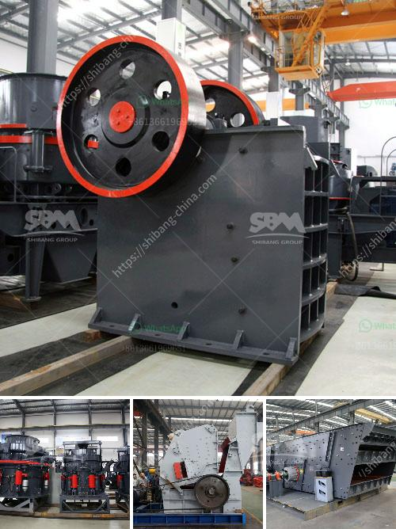

<h3>limestone ball milling</h3>
Limestone is one of the most commonly used materials in the construction industry. Its versatility and abundance make it an ideal choice for a wide range of applications, including building facades, road bases, and concrete production. However, in order to maximize its usefulness, limestone must go through a grinding process to create a fine powder that can be easily incorporated into various industrial applications.

One popular grinding method for limestone is ball milling. This process uses a rotating drum filled with steel balls or ceramic beads to grind the limestone particles to a finer size. The key to successful ball milling is to effectively control the grinding parameters, including the milling speed, ball size, ball-to-powder ratio, and grinding time. These factors have a significant impact on the final particle size distribution and the quality of the ground limestone.

The main advantages of limestone ball milling are its simplicity, versatility, and efficiency. Unlike other grinding methods, such as jet milling or attrition milling, ball milling is relatively easy to operate and requires minimal equipment. The rotating drum creates a cascading effect, causing the balls or beads to collide with the limestone particles and break them down through impact and attrition. This ensures a uniform size reduction and avoids overgrinding, which can damage the material and reduce its effectiveness.

Furthermore, ball milling allows for precise control over the grinding parameters, enabling the production of a wide range of particle sizes. This is particularly important in applications where specific particle size distributions are required, such as in the manufacturing of cement or filler materials. By adjusting the milling parameters, manufacturers can tailor the final product to meet the specific requirements of their customers.

In addition, limestone ball milling is highly efficient, allowing for high production rates and reduced energy consumption. The grinding process is typically conducted in a closed circuit, where the ground limestone is separated from the coarse particles and recycled back into the mill. This not only improves the efficiency of the grinding operation but also reduces the need for external classification equipment.

With its simplicity, versatility, and efficiency, limestone ball milling has become a preferred method for grinding limestone in the construction industry. Its ability to produce a fine and uniform powder makes it suitable for a wide range of applications, from concrete production to soil stabilization. Moreover, the ability to control the particle size distribution allows manufacturers to optimize the performance of their products.

In conclusion, limestone ball milling is a versatile and efficient grinding solution that offers numerous benefits for the construction industry. Its simplicity, versatility, and efficiency make it a popular choice for grinding limestone. By controlling the milling parameters, manufacturers can produce a wide range of particle sizes to meet the specific requirements of their applications. Furthermore, the high production rates and reduced energy consumption make limestone ball milling an attractive option for improving the efficiency of grinding operations.
<h3>Contact us</h3><ul><li><strong>Whatsapp:&nbsp;<a href="https://wa.me/8613661969651">+8613661969651</a></strong></li><li><a href="https://swt.shibang-china.com/?git&amp;zhl&amp;limestone ball milling"><strong>Online Service(chat now)</strong></a></li></ul><h3>Related</h3><ul><li><a href='vibrating feeder screen.md'>vibrating feeder screen</a></li><li><a href='vibrating vibrating grizzly feeder capacity.md'>vibrating vibrating grizzly feeder capacity</a></li><li><a href='feldspar powder ball mill.md'>feldspar powder ball mill</a></li><li><a href='crusher for sale kenya.md'>crusher for sale kenya</a></li><li><a href='kenya roller mill.md'>kenya roller mill</a></li></ul>