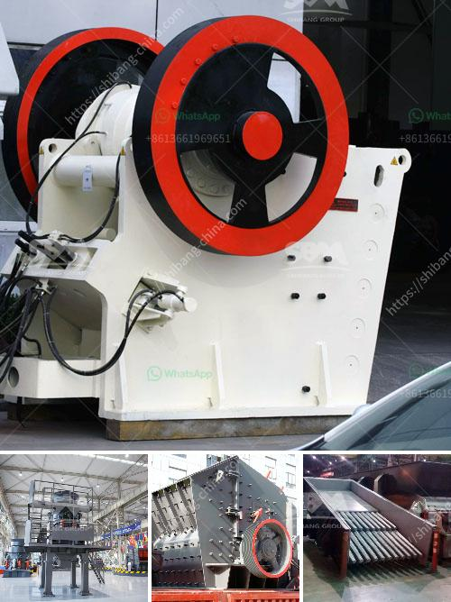

<h3>limestone crusher china</h3>
Limestone is the principal raw material for cement production, it constitutes around 80% of cement manufacturing and is used as an aggregate in concrete and asphalt. As construction industry in China continues to boom, the demand for limestone crusher is growing rapidly.

Limestone has a wide range of applications, especially in the construction industry. According to the different physical properties, limestone can be crushed into different sizes in the production processes of cement, crushed limestone aggregate, and lime. This is why limestone crusher China is so important.

To comply with the environmental regulations and improve the efficiency of production, traditional methods of crushing limestone may not be very safe or efficient. Without these advanced technologies, limestone mines have to rely on blasting to make raw materials, which results in large quantities of wastage, higher costs, and environmental pollution.

China, being the largest consumer of limestone aggregate, has invested heavily in the limestone mines to ensure that they have enough raw materials to meet the demand. To cope with the market demand, China has built large scale mines with advanced technology which include limestone crushers, conveyors, and high-tech control systems.

Limestone Crusher China is currently the leading brand in China with a 100% domestic market share. The products are used in a wide range of industries including cement, construction, gravel, metallurgy, chemical and road construction. The company has always been committed to fostering the growth of industries by providing them with better quality products and services backed by advanced technology and innovative solutions.

The limestone crushing system consists of a GBZ2000×10000 heavy-duty plate apron feeder and a PCF2018 single-stage hammer crusher. The designed production capacity is 500 tons per hour, but the actual production capacity is less than 400 tons per hour. After on-site observation, It was discovered that the feeding capacity was much smaller than expected, the crushing efficiency was not ideal, and the particle size of the finished product did not meet the requirements.

After analyzing the situation, the technician team of Limestone Crusher China improved the feeding system by optimizing the structure of the distributor plate and the design of the feeding chute. They also increased the motor power of the feeder, redesigned the spout, and improved the sealing device. Through these improvements, the feeding capacity increased significantly, and the crushing efficiency improved as well.

Furthermore, the technician team added a vibrating screen to the limestone crushing system to remove the fine particles that were affecting the production capacity. This enhanced the overall performance of the crusher and significantly increased the production capacity.

The successful implementation of these improvements by Limestone Crusher China has helped many limestone mines in China to increase their production capacity and reduce their energy consumption. It has also helped reduce the wastage of limestone and the environmental impact caused by traditional limestone mining methods.

In conclusion, Limestone Crusher China has a good market prospect in China and the Asia-Pacific region. It is currently the leading brand in China and the trustworthy partner of China's limestone enterprises. The crusher makes it possible to create aggregate with different particle sizes. The features and advantages of the crusher equipment are also improved significantly, making it the ideal choice for limestone processing.
<h3>Contact us</h3><ul><li><strong>Whatsapp:&nbsp;<a href="https://wa.me/8613661969651">+8613661969651</a></strong></li><li><a href="https://swt.shibang-china.com/?git&amp;zhl&amp;limestone crusher china"><strong>Online Service(chat now)</strong></a></li></ul><h3>Related</h3><ul><li><a href='fine powder grinder commercial.md'>fine powder grinder commercial</a></li><li><a href='ball mill grinding micronizer.md'>ball mill grinding micronizer</a></li><li><a href='list of used machines coal mining.md'>list of used machines coal mining</a></li><li><a href='coal pulverizer design.md'>coal pulverizer design</a></li><li><a href='coal crusher machine prices in india.md'>coal crusher machine prices in india</a></li></ul>