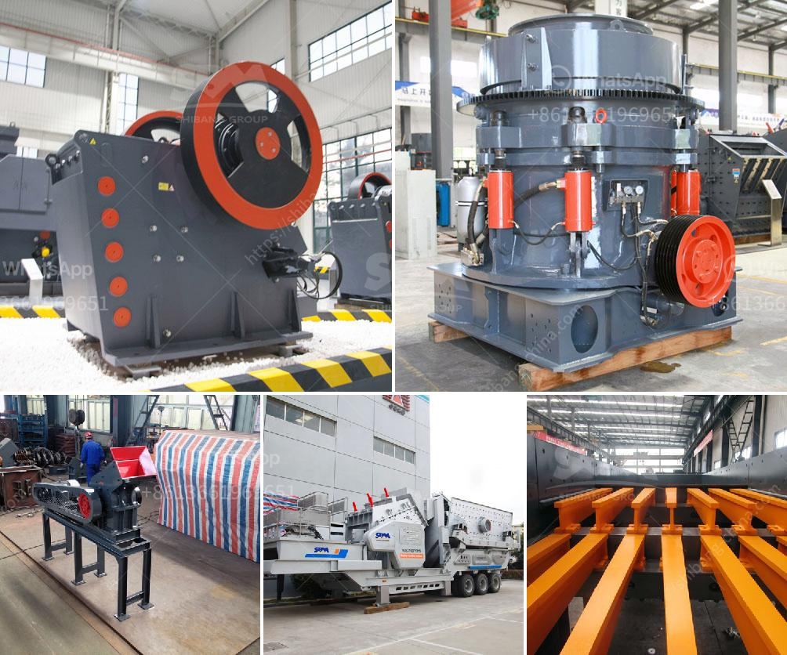

<h3>limestone crusher in cement plant for environmental</h3>
Limestone crusher is a crushing machine which is mainly used to process all kinds of limestones. Besides, this limestone equipment is widely used in many fields, such as power plant, metallurgy, chemical, cement, bridge construction, road construction and so on. The limestone crusher machine is a equipment which can crush materials about 600-1800mm into materials about 25mm or smaller. It can crush various kinds of medium hardness materials such as: limestone, slag, coke, coal and other materials. This kind of crusher has large crushing ratio, long service life, reasonable structure, convenient maintenance, etc. In all, this limestone crusher is widely used in industries like cement, agriculture, paint, paper, PVC, glass, etc. In addition, it is also popular to process limestone to make lightweight concrete, lightweight aggregate and various mortar products.

Limestone crusher plant is kind of special stone processing line for crushing hard mineral. To meet the production requirements, it can take coarse or fine crush for the limestone to produce stones of all sizes. This is beneficial to the deep processing of limestone in the later stage. Large amount of limestone is used as building material and important raw material for many industries. It is widely applied in various fields, such as highway, high-speed railway, rural-way, building sand, it is an ideal material in the construction industry. Limestone has the highest content of CaCO3. About 98% of limestone is calcium carbonate, it is the most common non-metallic mineral. Limestone is widely distributed on the earth's surface. It is one of the most valuable resources. It is a kind of sedimentary rock, which belongs to deposition rocks.

The limestone crusher used in cement plant for sale includes jaw crusher, impact crusher, cone crusher etc. The particle size of materials is suitable for various needs, the jaw crusher is suitable for the coarse crushing and secondary crushing of hard rock limestone, quartz stone and other materials in cement plant with the advantages of large production capacity, small particle size, and long service life. Cone crusher is also used to crush materials of medium and high hardness. The advantages of cone crusher are big reduction ration, high efficiency, low energy consumption, and uniform particle size.

For more environmental protection and cost-saving, customers could select the limestone crusher with efficient and reliable working condition as primary crushing machine. The environmentally friendly mobile crushing stations produced by our company can be divided into two types: tire-type stations and crawler-type. Among them, tire-type crushers are mainly used for crushing small and medium-sized ore and stone yards, while crawler mobile crushers are mostly used for more severe conditions Mountain gravel operations. In addition, the Red Star mobile crusher is low-carbon and environmentally friendly, and the price is relatively affordable.
<h3>Contact us</h3><ul><li><strong>Whatsapp:&nbsp;<a href="https://wa.me/8613661969651">+8613661969651</a></strong></li><li><a href="https://swt.shibang-china.com/?git&amp;zhl&amp;limestone crusher in cement plant for environmental"><strong>Online Service(chat now)</strong></a></li></ul><h3>Related</h3><ul><li><a href='list mines and quarry owners of malaysia.md'>list mines and quarry owners of malaysia</a></li><li><a href='static jaw crusher for sale in south africa.md'>static jaw crusher for sale in south africa</a></li><li><a href='supplier of vibrating screen in philippines.md'>supplier of vibrating screen in philippines</a></li><li><a href='i need for a stone crushing plant.md'>i need for a stone crushing plant</a></li><li><a href='second hand stone crusher equipment medium size.md'>second hand stone crusher equipment medium size</a></li></ul>