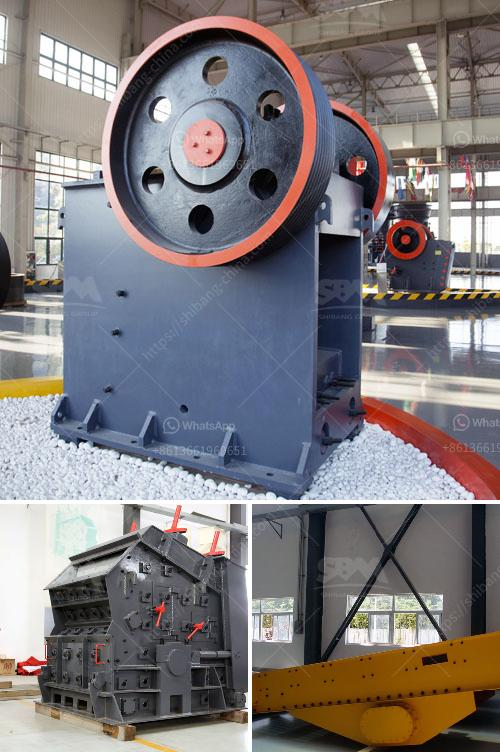

<h3>limestone crusher mining equipment</h3>
Limestone is a sedimentary rock composed mostly of the mineral calcite and comprising about 15% of the Earth's sedimentary crust. It is a basic building block of the construction industry and a chief material from which aggregate, cement, lime, and building stone are made. 71% of all crushed stone produced in the U.S. is either limestone or dolomite.

As a source for lime, it is used to make paper, plastics, glass, paint, steel, cement, carpets, used in water treatment and purification plants, and in the processing of various foods and household items (including medicines).

Limestone is also used as a filler in a variety of products, including paper, plastic, and paint. The purest limestone is even used in foods and medicines such as breakfast cereals and calcium pills.

Limestone crusher is applied widely in limestone crushing industry. Many limestone crushing plants include limestone crusher and limestone mill or other related limestone crushing equipment. Limestone mining has important position in modern construction and road building industry because limestone is the most widely used stone or rock. Keid is China leading limestone mining equipments supplier and can supply you many limestone mining machines such as limestone mining crusher, limestone mining mill, limestone mining screen machines etc.

Limestone crushing production line is an important link in burnt lime production line and cement production line. DSMAC has its own proprietary products screening crusher is designed for crushing limestone and designed. Limestone is an important raw material of limestone gravel plants, aggregate plants, has a wide range of applications, our company provides the crusher wear parts can increase the life expectancy of 3.2 times, exports to the United Kingdom, the United States, Canada, Indonesia, the Philippines, India, Australia, 80 countries and regions, including Lafarge, Heidelberg, Holcim, the world's leading cement companies.

Limestone crusher mining equipment includes limestone quarry crusher and limestone crusher plant, which play important role in the limestone crushing process. Besides, there are crusher machines for limestone mine mining, such as jaw crusher, cone crusher, impact crusher, hammer crusher and limestone mobile crusher (like limestone mobile jaw crusher). Limestone crushing process types and 1000 000 ton/year limestone crushing plant for cement production plant.

DMAC Forum, Organic SEO, Natural SEO, Online Marketing, Ethical SEO Rules and Practice, Paying for SEO, PPC Management, SEO News, Legal Issues, SEO Tools, Search Engines, Link Popularity, Google, Yahoo, MSN, Personalized Search, Blog Search, Directory Search, Discussion Forums, SEO Directories, Local Search, Vertical Search, Image Search, Podcast Search, News Search, SEO Services, Keyword Research, Competitive Intelligence, Site Architecture, URL Structure, Page Layout, Site Maps, Affiliate Marketing, Analytics, Reporting, Site Clinic, Link Development, Social Media Marketing, Book Reviews, Local Search Engines, Small Business SEO, SEO Jobs, SEO Education, SEO Design Tips, Advertising SEO, Shopping Search Engines, Business to Business SEO, New Marketing Channels, International Search, SEO Consultants and Developers, Content Management Systems, HTML and CSS, Web Design, Usability and Accessibility, Web Development Software, URL Canonicalization, Cookie Usage and Search Engines, Domain Names, IP Canonicalization, Meta Tags and HTML Title Tags, Robots.txt and Meta Robots, cloaking, RSS, Copyrights, Trademarks and Domain Names, Privacy & Spam Issues, DMCA, Web Site Testing, SEO and Web Design Tools, SEO Best Practices, Special Offers, Exhibition Of Crushing Machines.
<h3>Contact us</h3><ul><li><strong>Whatsapp:&nbsp;<a href="https://wa.me/8613661969651">+8613661969651</a></strong></li><li><a href="https://swt.shibang-china.com/?git&amp;zhl&amp;limestone crusher mining equipment"><strong>Online Service(chat now)</strong></a></li></ul><h3>Related</h3><ul><li><a href='gypsum board crusher machine.md'>gypsum board crusher machine</a></li><li><a href='raymond mills for sale in pakistan.md'>raymond mills for sale in pakistan</a></li><li><a href='difference between jaw crusher and cone crusher.md'>difference between jaw crusher and cone crusher</a></li><li><a href='german sand wash machine.md'>german sand wash machine</a></li><li><a href='production process of calcium carbonate.md'>production process of calcium carbonate</a></li></ul>