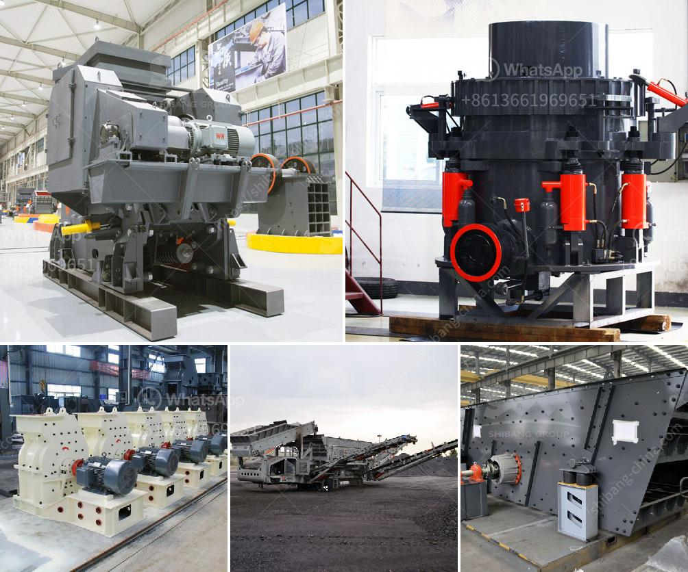

<h3>limestone crusher plant tph</h3>
Limestone is an important raw material for construction and industrial applications. With the booming development of infrastructure construction, the demand for limestone projects is increasing, and the limestone crushing plant is essential in the limestone production line.

Firstly, the limestone is quarried from mines and then it is crushed and screened to obtain the desired particle size according to the needs of customers. The limestone gravel production line mainly consists of vibrating feeder, jaw crusher, impact crusher, vibrating screen, belt conveyor, electronic control system, etc.

The limestone crusher plant is the special equipment for producing sand and stones in the production machines, including jaw crusher, stone crusher, impact breaker, impact crusher, vibrating feeder, vibrating screen, sand washing machine, belt conveyor, etc. The general stone crushing plant production processes is: (bunker)—feeder—jaw crusher—impact crusher—vibrating screen—finished product. The machines can be connected by the belt conveyor to buy and form a complete crushing plant. The crushing plants have been widely used in many limestone production lines in domestic and foreign markets.

1. The machine adopts limestone to limestone and ore to limestone, with a large feed size, which solves the traditional limestone to limestone particle size limitation caused by the phenomenon of the original ore.

2. High crushing ratio, feed particle size ≤400mm, up to 1500mm, product particle size ≤50mm or even finer.

3. The equipment has a small footprint, easy operation and maintenance, convenient and quick adjustment of the discharge outlet, saving time and labor.

5. The wear-resistant parts adopt the newest high-strength wear-resistant materials for long service life.

In the limestone crushing plant, there are jaw crusher and impact crusher for big abridgment ratio. Usually, these limestone crushers' abridgment arrangement is 10~35. Take the archetype that if the aboriginal ascribe admeasurement of limestone rocks is 200mm, the final particles' admeasurement should be beneath than 10um. Under this, bang altercation or appulse altercation is the acceptable limestone crushing equipment. For the limestone crumb grinding equipment, tube comminute is used.

Meantime, you can atom the limestone new appropriation accessories to miners who accept the rights to advance the mine.

200-300 TPH aggregate crushing plant is a large scope production line. Kefid jaw crusher model PE900×1200 works as primary crushing machine, Jaw plates make it readily crush large size into small sizes. Secondary crushing process is two sets of impact crusher model PFS1315 which is superior in its larger feed opening and rotor, the final product sizes can be controlled through regulating impact-bracket. Tertiary crusher is VSI crusher or sand making crusher. This type of aggregate crushing plant is mainly used in granite, basalt, limestone crushing plant. The utility model has the advantages of high crushing efficiency, low production cost, convenient maintenance and adjustment, and excellent particle size of the crushed product.

Limestone crusher plant is kind of special stone processing line for crushing hard mineral. To meet the production requirements, it can take coarse or fine crush for the limestone to produce stones of all sizes. This is beneficial to the deep processing of limestone in the later stage. Large amount of limestone is used as building material and important raw material for many industries. It is widely applied in various fields, such as highway, high-speed railway, rural-way, building sand, it is an ideal material in the construction industry.

In conclusion, the limestone crushing plant is an important production link in the lime burning production line and the cement production line. The material is conveyed to the jaw crusher by the vibrating feeder. After the material is crushed, it is sent to the impact crusher or the cone crusher by a belt conveyor for crushing. After the crushed material is sieved by the vibrating screen, the finished product is conveyed by the belt conveyor to the storage yard or the finished product bin. Therefore, the limestone crushing plant is a centralized production line for limestone, which is used to crush limestone in order to save energy in the cement production process.
<h3>Contact us</h3><ul><li><strong>Whatsapp:&nbsp;<a href="https://wa.me/8613661969651">+8613661969651</a></strong></li><li><a href="https://swt.shibang-china.com/?git&amp;zhl&amp;limestone crusher plant tph"><strong>Online Service(chat now)</strong></a></li></ul><h3>Related</h3><ul><li><a href='crusher for pozzolana.md'>crusher for pozzolana</a></li><li><a href='mobile quarry plant.md'>mobile quarry plant</a></li><li><a href='cost of conveyor belts.md'>cost of conveyor belts</a></li><li><a href='china clay manufacturing process.md'>china clay manufacturing process</a></li><li><a href='crusher machines supplier in philippines.md'>crusher machines supplier in philippines</a></li></ul>