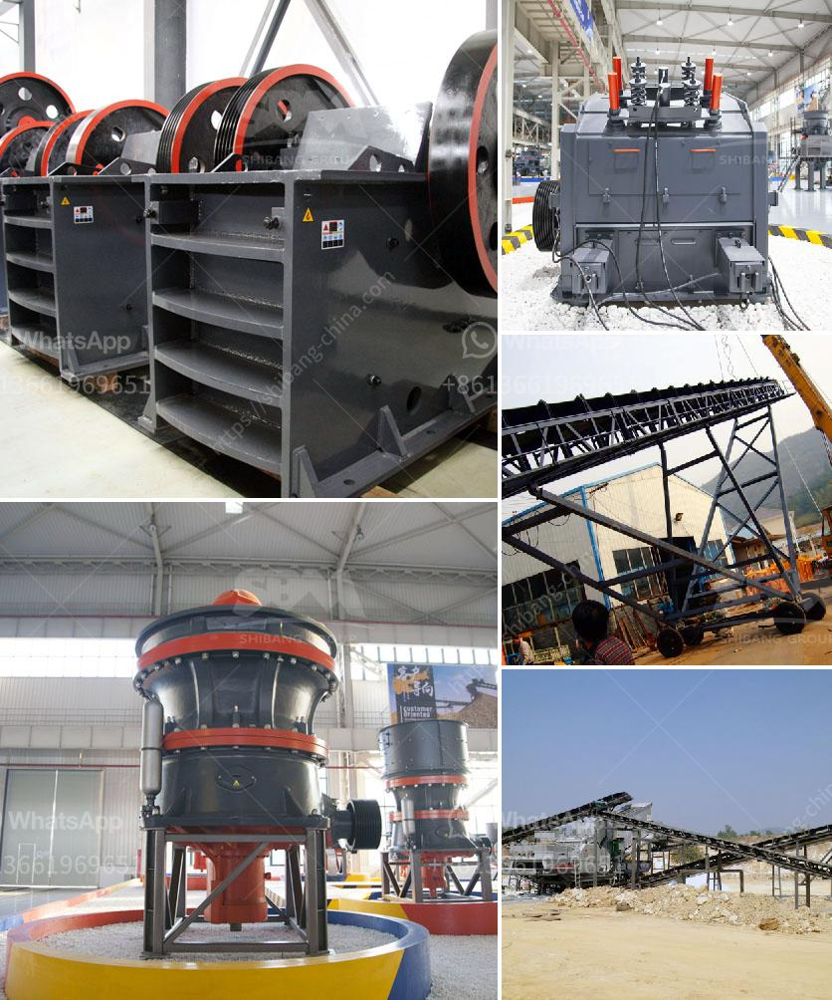

<h3>limestone crusher plant</h3>
Limestone is one of the most common types of sedimentary rocks found on Earth. It forms from the remains of marine organisms like coral and shells, which settle on the ocean floor over time. This process creates layers of sediment that eventually harden and form limestone.

Limestone has a wide range of uses, including in construction, agriculture, and manufacturing. It is commonly used as a building material, as it is durable, readily available, and easy to shape. Limestone is also used in agricultural settings to adjust soil pH levels and provide essential nutrients to crops. Additionally, it is a key ingredient in the production of cement and various industrial products.

To extract limestone, it needs to be crushed into small pieces. The limestone crushing plant is a crucial part of the limestone production line, as it determines the final products' specifications. In order to meet the different requirements of customers, Fote Heavy Machinery has designed various limestone crushing machines for a wide range of applications.

Fote limestone crusher plant, also known as the limestone crushing plant, is mainly used for crushing limestone, rocks or other aggregate materials. It is commonly used in various fields, such as cement industry, mining industry, construction industry, chemical industry and silicate industry. It has simple structure, reliable operation, easy maintenance, low production cost, and high crushing efficiency.

The crushing capacity of our limestone crusher can be up to 1000 TPH, the maximum feeding size is 1.3 meters in diameter. Different models have different feeding sizes and outputs. As for the prices, we also have different models and different prices depending on the production capacity. We welcome you to contact us at any time for a quotation.

Overall, the limestone crusher plant is a highly automated equipment, featuring low investment, simple operation, easy maintenance and high efficiency. It can be used in various industries, including mining and construction, and can crush a variety of materials, including limestone, slag, granite, quartz, pebbles, etc. The crushing plant can also be tailored to your specific requirements. Fote Heavy Machinery is your best choice!
<h3>Contact us</h3><ul><li><strong>Whatsapp:&nbsp;<a href="https://wa.me/8613661969651">+8613661969651</a></strong></li><li><a href="https://swt.shibang-china.com/?git&amp;zhl&amp;limestone crusher plant"><strong>Online Service(chat now)</strong></a></li></ul><h3>Related</h3><ul><li><a href='sand and gravel suppliers located in cebu.md'>sand and gravel suppliers located in cebu</a></li><li><a href='crushers for sale south africa.md'>crushers for sale south africa</a></li><li><a href='quarry crusher cost.md'>quarry crusher cost</a></li><li><a href='price list for crusher machine sayaji.md'>price list for crusher machine sayaji</a></li><li><a href='industrial application of pebble mill.md'>industrial application of pebble mill</a></li></ul>