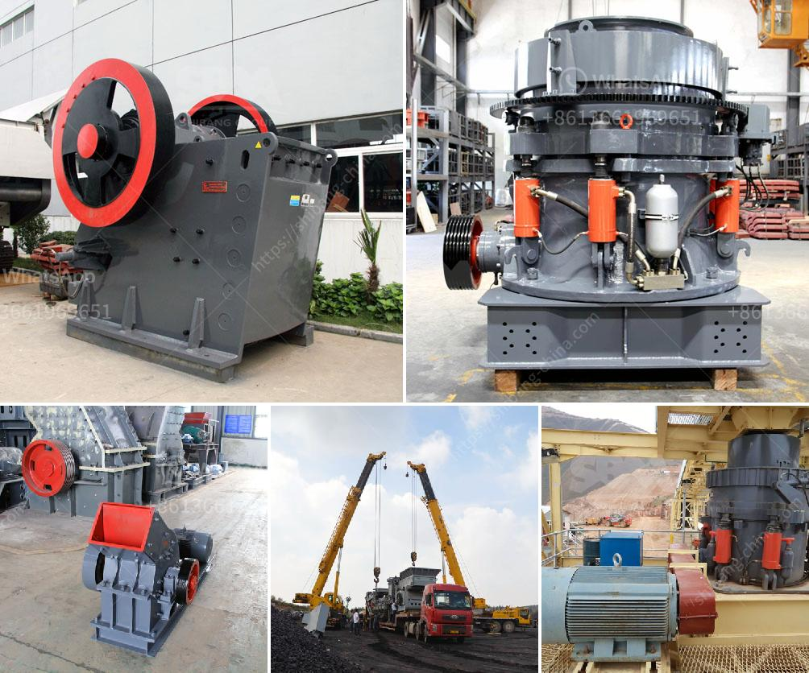

<h3>limestone crushing plant</h3>
Limestone is a sedimentary rock composed mostly of calcium carbonate (CaCO3), which is found in abundance across the globe. Limestone is primarily used for construction purposes, especially as a raw material for cement production. Limestone crushing plants are important equipment for limestone processing. Limestone commonly is classified into two categories: fine Limestone and coarse Limestone. Limestone Crushing Plant:

Limestone crushing operation is the processes of dealing and processing of nonmetallic mineral materials for construction industry. Nonmetallic mineral material will be first quarried or mined and then conveyed to the processing plant for further classification or further size reduction by Limestone. The Limestone crushing production line process is as follows:

1. Feeding: Feed the raw Limestone materials into the Jaw Crusher evenly and gradually by Vibrating Feeder through a hopper for primary crushing.

2. Coarse crushing: After the primary crushing, the materials are transported to impact crusher or cone crusher for further crushing. The crushed materials will be screened by vibrating screen.

3. Fine crushing: The material that meets the size requirements will be transported to the finished product stack through the belt conveyor, and the material that does not meet the size requirements will be returned to the impact crusher or cone crusher for re-crushing, forming a closed circuit for multiple cycles.

4. Screening: The finished products of various specifications are screened out from the vibrating screen and become the finished products of the demand size.

Limestone crushing plants are designed with different production capacities, such as 40-80 t/h limestone crushing plant, 100-150 T/H limestone crushing plant, 150-220 tph limestone crushing plant , 250-300 tph limestone crushing plant and the largest scale 40-1000 t/h limestone crushing plant for sale.

The market of limestone crushing plants has been developing rapidly due to its wide application fields. And the demand for crushing plant for limestone is growing rapidly. These machines have been sold in different countries around the world, such as South Africa, Zambia, Zimbabwe, Kenya, Tanzania, Uganda, Russia, and so on.

Over the years, our company has been focusing on the R&D and manufacturing of limestone crushing plant. With more than 20 years of experience and technological innovation, we have produced a variety of machines suitable for different industries and applications.

Our company can provide different configurations of limestone crushing plant according to the specific requirements of customers. Different crushing plant can be equipped with different crushing equipment, such as jaw crusher, impact crusher, cone crusher, vibrating screen and so on. All of these machines work together as a complete limestone crushing plant.
<h3>Contact us</h3><ul><li><strong>Whatsapp:&nbsp;<a href="https://wa.me/8613661969651">+8613661969651</a></strong></li><li><a href="https://swt.shibang-china.com/?git&amp;zhl&amp;limestone crushing plant"><strong>Online Service(chat now)</strong></a></li></ul><h3>Related</h3><ul><li><a href='gypsum grinding machine in india.md'>gypsum grinding machine in india</a></li><li><a href='industrial cone crusher.md'>industrial cone crusher</a></li><li><a href='used ball mill for sale india.md'>used ball mill for sale india</a></li><li><a href='ball milling method in tamil.md'>ball milling method in tamil</a></li><li><a href='mini concrete crusher.md'>mini concrete crusher</a></li></ul>