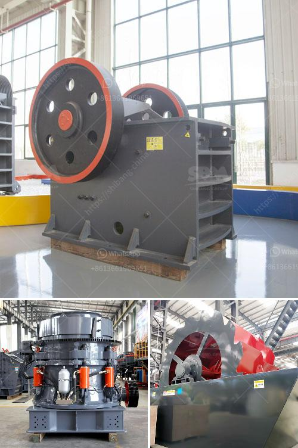

<h3>limestone crushing processing for the manufacture</h3>
Limestone is a sedimentary rock composed mostly of calcium carbonate (CaCO3), usually in the form of calcite or aragonite. It may contain other minerals such as magnesium carbonate or dolomite. It is a popular building material and a raw material used in many industries, such as cement production, agriculture, and chemicals manufacturing.

The process of limestone crushing involves several stages, including primary crushing, secondary crushing, and tertiary crushing. First, in the primary crushing stage, limestone chunks are reduced to a size of about 10 inches by a jaw crusher. Often, the primary crusher is located inside a pit, where it is continuously fed with limestone rocks from the blasting process.

After the primary crushing, the crushed limestone is further processed in a secondary crusher known as the impact crusher or cone crusher. In the secondary stage, the limestone is reduced to sizes between 0.5 and 2 inches. A vibrating screen separates the limestone into different sizes and removes any oversized material.

Finally, in the tertiary crushing stage, the crushed limestone is further reduced to a size of about 3/4 inches or smaller. This stage involves the use of cone crushers or vertical shaft impact crushers. The vibrating screen is again used to separate different sizes of limestone and remove any remaining oversized particles.

The crushed limestone is then screened and stored in a stockpile for further processing. The stockpile can be covered to prevent the material from being exposed to rain or extreme weather conditions. From the stockpile, the limestone can be transported to the manufacturing plant for various applications.

One of the primary uses of crushed limestone is in the production of cement. Limestone is added to the cement clinker during the grinding process to provide the necessary calcium oxide and some additional chemical components for proper cement hydration.

In addition to cement, limestone is used in the production of lime, which is used in agriculture to improve soil quality and reduce soil acidity. It is also used as a flux in steel production to remove impurities and improve the quality of the final product.

The manufacturing process for limestone crushing is relatively simple. Machines such as jaw crushers, impact crushers, cone crushers, and vertical shaft impact crushers are used to crush limestone and hammer mills are used to further crush the limestone particles.

No matter what kind of limestone processing equipment is used in the crushing stage, it is necessary to select equipment with high wear resistance and good performance to ensure the stable operation of the limestone processing plant. Considering the hardness of limestone, it is advisable to choose jaw crusher as the primary crushing equipment and impact crusher as the secondary crushing equipment. Selection of equipment should be based on the properties of limestone, such as hardness, moisture content, and abrasiveness.

In conclusion, limestone crushing processing is a complex process that requires various types of equipment. Selection of the optimal equipment for each stage is essential to ensure the efficiency and quality of the final product.
<h3>Contact us</h3><ul><li><strong>Whatsapp:&nbsp;<a href="https://wa.me/8613661969651">+8613661969651</a></strong></li><li><a href="https://swt.shibang-china.com/?git&amp;zhl&amp;limestone crushing processing for the manufacture"><strong>Online Service(chat now)</strong></a></li></ul><h3>Related</h3><ul><li><a href='iron ore smelter equipment.md'>iron ore smelter equipment</a></li><li><a href='small rock crushers for recreation.md'>small rock crushers for recreation</a></li><li><a href='rock crusher plants in germany.md'>rock crusher plants in germany</a></li><li><a href='mobile crusher for.md'>mobile crusher for</a></li><li><a href='cost of crusher machine in ethiopia.md'>cost of crusher machine in ethiopia</a></li></ul>