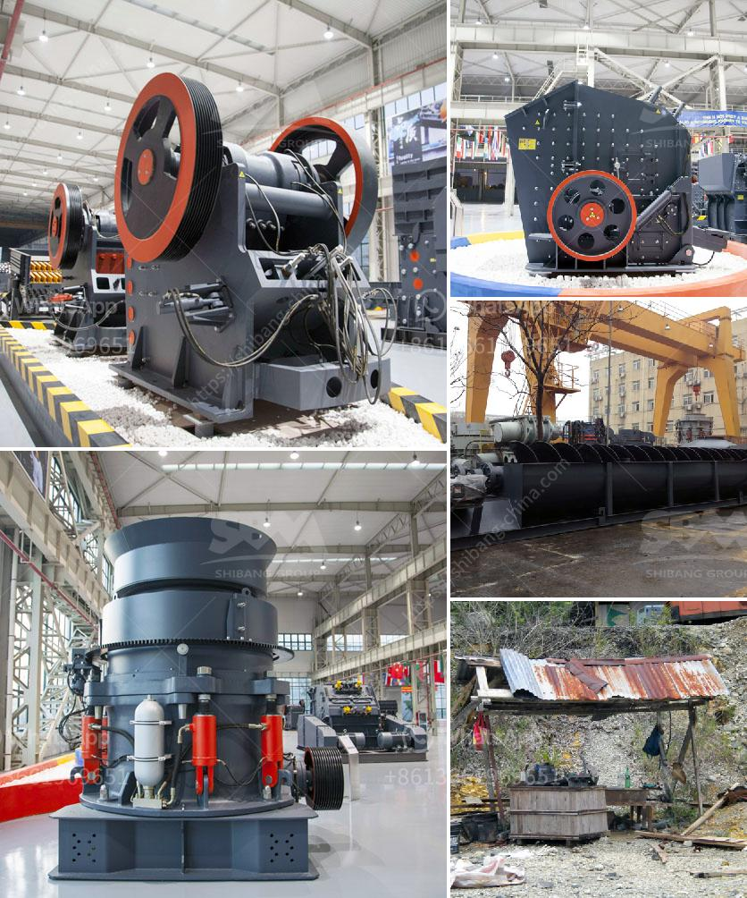

<h3>limestone powder machine in india</h3>
Limestone is a sedimentary rock, composed mainly of calcium carbonate (CaCO3), which is obtained through the process of mining limestone. It is widely used in various industries such as construction, agriculture, and manufacturing, thanks to its abundance and versatility.

In India, limestone is found in abundant quantities and is predominantly sourced from the states of Rajasthan, Madhya Pradesh, Andhra Pradesh, Gujarat, Maharashtra, and Chhattisgarh. Once extracted, limestone undergoes several processes to be converted into a usable form, one of which is the production of limestone powder.

Limestone powder is produced by grinding limestone rocks using specific grinding machinery. Limestone powder machines are an integral part of the limestone processing industry. With advancements in technology leading to efficient and high-performance limestone powder machines, India has witnessed a boom in the limestone powder manufacturing sector.

These machines are used in limestone powder plants where the limestone is first pulverized and then dried using a dryer system. The dried limestone powder is then stored in silos or packed into bags for commercial use. The limestone powder produced by these machines is used in various applications such as cement manufacturing, lime production, soil stabilization, and as a filler material in various industries.

Limestone powder machines in India have undergone constant improvements to ensure better grinding efficiency and ease of use. These machines are equipped with advanced features like high-speed rotation and precise grinding, which ensure consistent particle size distribution and eliminate any impurities in the limestone powder.

Moreover, the automation of these machines has increased their productivity, reduced manual intervention, and minimized the chances of human error. This has resulted in cost-effective production and enhanced product quality, making Indian limestone powder machines highly sought after in the global market.

In conclusion, limestone powder machines play a vital role in the limestone processing industry in India. With the availability of abundant limestone reserves and advancements in technology, these machines have become more efficient, reliable, and cost-effective. The growing demand for limestone powder in various industries further fuels the need for high-performance limestone powder machines in India.
<h3>Contact us</h3><ul><li><strong>Whatsapp:&nbsp;<a href="https://wa.me/8613661969651">+8613661969651</a></strong></li><li><a href="https://swt.shibang-china.com/?git&amp;zhl&amp;limestone powder machine in india"><strong>Online Service(chat now)</strong></a></li></ul><h3>Related</h3><ul><li><a href='cost of a small scale cement plant in india.md'>cost of a small scale cement plant in india</a></li><li><a href='stone crushing in mineral processing.md'>stone crushing in mineral processing</a></li><li><a href='second hand stone crusher equipment medium size.md'>second hand stone crusher equipment medium size</a></li><li><a href='cost of stone crusher in nigeria.md'>cost of stone crusher in nigeria</a></li><li><a href='mobile crusher plant south africa.md'>mobile crusher plant south africa</a></li></ul>