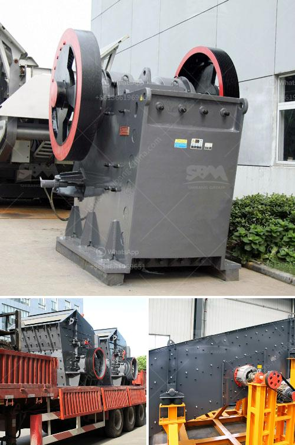

<h3>limestone powder making plant ireland</h3>
Ireland, known for its verdant landscapes and historical sites, is also home to a thriving construction industry. With a concerted effort towards sustainability, the demand for limestone powder is on the rise as it becomes a key component in the construction sector. This article will explore the process of limestone powder production in Ireland, its applications, and the positive impact it has on the environment.

Firstly, let's delve into the process of limestone powder production. Limestone, a sedimentary rock primarily composed of calcium carbonate, is widely abundant in Ireland. In the limestone powder making plant, limestone stones are first crushed into smaller particles. The crushed limestone is then ground into a fine powder, resulting in limestone powder that is used in various applications.

The applications of limestone powder are manifold, making it a versatile and indispensable material. In the construction industry, limestone powder is widely used in the production of cement. When mixed with water and aggregates, such as sand and gravel, limestone powder acts as a binding agent, enhancing the strength and durability of concrete structures. Additionally, limestone powder is also used as a filler in asphalt for road construction, providing stability and reducing cracking.

Beyond its role in construction, limestone powder has various other applications. In agriculture, limestone powder is used as a soil amendment to balance pH levels and increase nutrient absorption. This helps optimize crop growth and improve overall soil health. In the manufacturing industry, limestone powder is used in the production of glass, ceramics, and even cosmetics. Its unique properties, including high calcium content and fine particle size, make it an ideal ingredient in such applications.

Apart from its diverse applications, limestone powder production in Ireland has a significant positive impact on the environment. The extraction of limestone for powder production often occurs in quarries, which are carefully managed to minimize environmental disruption. Restoration programs are implemented to rehabilitate quarry sites once extraction is complete, ensuring the land is returned to its natural state or repurposed for other sustainable uses.

Furthermore, limestone powder itself has eco-friendly qualities. It is a natural product, inherently abundant, and does not require energy-intensive processes for its production. When used in building materials, limestone powder helps reduce carbon emissions. Cement production, one of the major contributors to carbon dioxide emissions, can be optimized by using limestone powder as a partial substitute for traditional cement constituents, thereby reducing the carbon footprint of construction projects.

In conclusion, limestone powder production in Ireland plays a vital role in the nation's sustainable construction landscape. From the extraction of limestone to its transformation into a fine powder, this versatile material serves multiple purposes, ranging from building materials to agricultural amendments. With its eco-friendly qualities and positive impact on carbon emissions, limestone powder is poised to be a key component in the Irish construction industry's drive towards sustainability.
<h3>Contact us</h3><ul><li><strong>Whatsapp:&nbsp;<a href="https://wa.me/8613661969651">+8613661969651</a></strong></li><li><a href="https://swt.shibang-china.com/?git&amp;zhl&amp;limestone powder making plant ireland"><strong>Online Service(chat now)</strong></a></li></ul><h3>Related</h3><ul><li><a href='companies that sell industrial ball mills in malaysia.md'>companies that sell industrial ball mills in malaysia</a></li><li><a href='hammers mill machine.md'>hammers mill machine</a></li><li><a href='cost of conveyor belts.md'>cost of conveyor belts</a></li><li><a href='crushing equipment aggregates crushing.md'>crushing equipment aggregates crushing</a></li><li><a href='india jaw crusher of small capacity.md'>india jaw crusher of small capacity</a></li></ul>