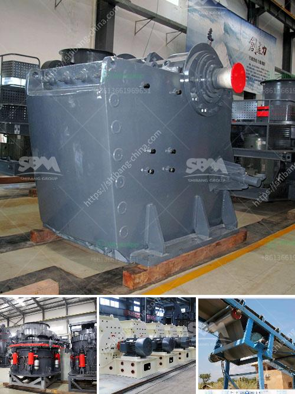

<h3>limestone quarrying process</h3>
Limestone quarrying is a complex process, involving different stages, with various methods employed to extract stone from the earth. As limestone is one of the most versatile rocks, a significant amount of quarrying activity goes on each year to meet the global demand for limestone products.

Quarrying involves the removal of earth and stone materials from a site, allowing for greater access to the limestone deposits. The process, often known as quarrying, can be considered in four parts: extraction, sorting, crushing, and storage.

Firstly, large blocks of limestone are extracted from the quarry. These blocks then need to be carefully sorted to remove any unwanted materials, such as clay, mud, or small stones. This process is known as "stripping," and it ensures that only high-quality limestone is used for further processing.

Once the limestone has been stripped, it is transported to a crushing plant where it is broken down into smaller pieces. Crushers are used to reduce the size of the limestone into manageable chunks, which can then be used in various applications. The crushing process is important as it determines the quality and size of the final product.

After the limestone has been crushed, it is then transported to storage facilities. These facilities are usually large storage silos, where the limestone is kept until it is needed for further processing. The storage process is crucial, as it ensures a consistent supply of limestone for various industrial applications.

There are several methods employed for quarrying limestone, each with its advantages and disadvantages. The most common method is drilling and blasting, where explosives are used to break up the rock. This method is often employed when the limestone is located in hard-to-reach areas or beneath the earth's surface.

Another method used is called channeling, where a narrow channel is cut into the rock using a machine. This method is often used when the limestone is close to the surface and can be easily accessed.

Quarrying limestone can have both positive and negative impacts on the environment. On one hand, quarrying creates jobs and contributes to local economies. It also provides materials for construction and infrastructure projects.

However, quarrying can also have negative environmental effects. The process can disrupt wildlife habitats and damage the natural landscape. It can also create excessive noise and dust pollution, which can affect nearby communities and ecosystems.

To mitigate these impacts, quarrying companies often implement environmental management plans. Measures such as reclamation and restoration of quarried areas, dust suppression, and noise reduction techniques are employed to minimize the environmental footprint of limestone quarrying.

In conclusion, limestone quarrying is a complex process that involves several stages, including extraction, sorting, crushing, and storage. Different methods are used to extract and process limestone, depending on its location and quality. While quarrying provides important materials for various industries, it can also have negative environmental impacts. Therefore, it is crucial for quarrying companies to implement effective environmental management plans to mitigate these effects and ensure sustainable practices.
<h3>Contact us</h3><ul><li><strong>Whatsapp:&nbsp;<a href="https://wa.me/8613661969651">+8613661969651</a></strong></li><li><a href="https://swt.shibang-china.com/?git&amp;zhl&amp;limestone quarrying process"><strong>Online Service(chat now)</strong></a></li></ul><h3>Related</h3><ul><li><a href='gold mining crushing and milling machine.md'>gold mining crushing and milling machine</a></li><li><a href='clay working clay powder making machine.md'>clay working clay powder making machine</a></li><li><a href='ball mill hammer mill roller mill machine.md'>ball mill hammer mill roller mill machine</a></li><li><a href='mining equipment for sale zimbabwe.md'>mining equipment for sale zimbabwe</a></li><li><a href='mobile screen and crushing.md'>mobile screen and crushing</a></li></ul>