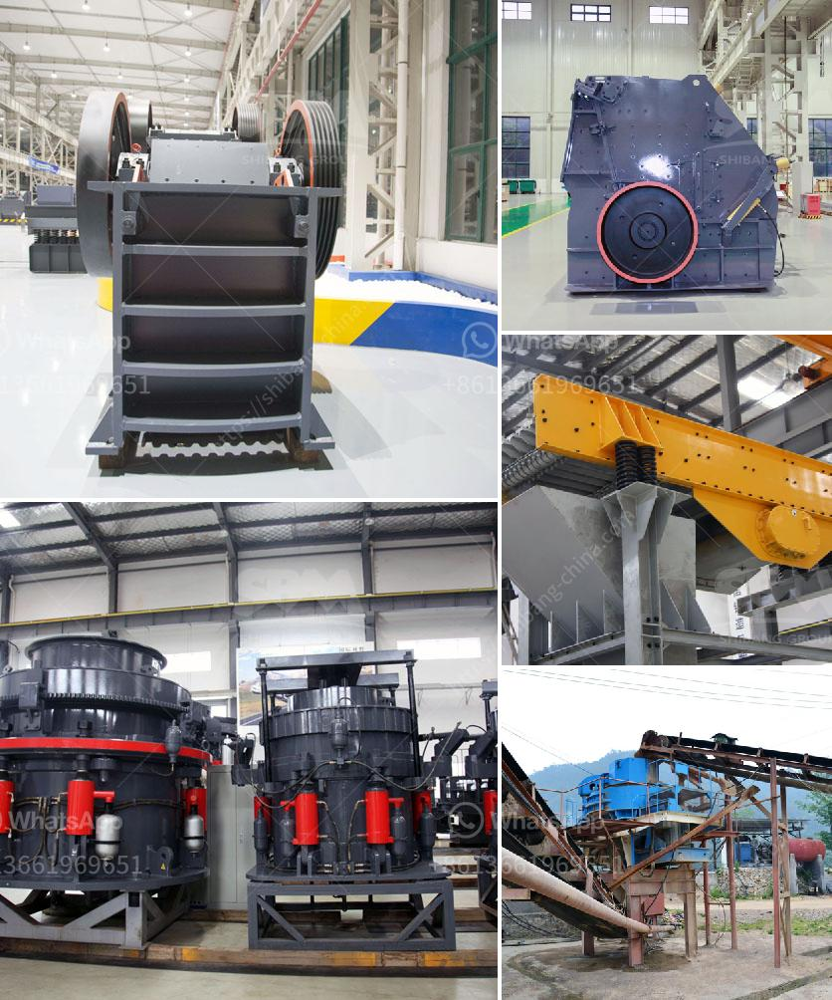

<h3>limestone rock crushing</h3>
Limestone rock is a widely used building material that has been utilized for centuries. It is formed by the deposition of remains of marine organisms like coral and shells. Limestone rock is a sedimentary rock, which means it is formed through the accumulation of layers of minerals and organic matter over time.

One of the primary uses of limestone rock is as a construction aggregate in the building and road construction industry. It is crushed into different sizes and used as a base material for roads, driveways, and foundations. The crushed limestone is also used as a filler in various products, such as rubber, paint, and plastics.

The process of crushing limestone rock to produce aggregates involves various stages. First, the limestone rock is blasted from the quarry and then it is fed into a primary jaw crusher for initial crushing by reduction in size. The crushed material is then transported by a belt conveyor to a secondary impact crusher for further crushing. Finally, the crushed limestone is screened into various sizes for further processing and uses.

Crushing limestone rock is a highly energy-intensive process. The smaller the particle size obtained after crushing, the more energy is required for crushing. Therefore, it is important to minimize the energy consumption during the crushing process to reduce costs and minimize environmental impacts.

Crushing equipment plays a critical role in the efficiency and effectiveness of limestone rock crushing. Modern crushing machines are equipped with advanced features that optimize the crushing process, such as automated control systems, hydraulic adjustments, and variable speed drives. These features help to achieve a more precise and efficient crushing process, resulting in higher-quality aggregates.

In conclusion, limestone rock crushing is a crucial step in construction and aggregate production that involves various stages and equipment. The efficient and precise crushing of limestone rock is essential to maximize the quality and minimize the cost of the end product. With the advancements in crushing technology, the process has become more optimized, leading to better results and reduced environmental impacts.
<h3>Contact us</h3><ul><li><strong>Whatsapp:&nbsp;<a href="https://wa.me/8613661969651">+8613661969651</a></strong></li><li><a href="https://swt.shibang-china.com/?git&amp;zhl&amp;limestone rock crushing"><strong>Online Service(chat now)</strong></a></li></ul><h3>Related</h3><ul><li><a href='barite grinding machine germany.md'>barite grinding machine germany</a></li><li><a href='used marble machinery turkey.md'>used marble machinery turkey</a></li><li><a href='jaw crusher machine in dubai.md'>jaw crusher machine in dubai</a></li><li><a href='silica sand washing process.md'>silica sand washing process</a></li><li><a href='marble grinder price in india.md'>marble grinder price in india</a></li></ul>