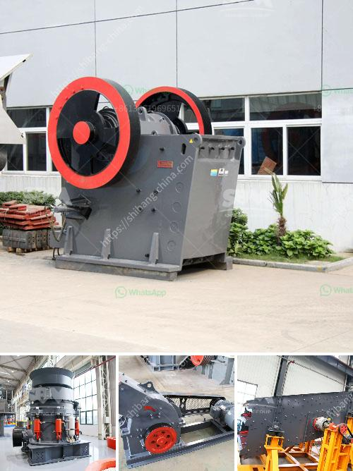

<h3>limestone vertical mill</h3>
Limestone is a sedimentary rock that is mainly composed of calcium carbonate. The mineral is extracted from the earth's crust by quarrying or mining methods, particularly in areas where large deposits of this valuable mineral are found. Once extracted, limestone undergoes various processes to turn it into a useful product for construction, agriculture, and many other industries.

In recent years, the advent of limestone vertical mills has revolutionized the mining industry. A limestone vertical mill is a device that enables efficient grinding of limestone into powder form. This machine plays a crucial role in limestone mining operations where limestone is milled and prepared for various applications.

These vertical mills consist of a rotating table that contains vertical rollers or hammers, which crush the limestone against the grinding ring. The crushed limestone particles then pass through a classifier, separating the fine and coarse particles. The fine particles are collected and used in various applications, while the coarse particles are sent back for further grinding.

One of the key advantages of limestone vertical mills is their ability to grind limestone to a precise fineness. This finely ground limestone is extremely valuable in industries such as cement production, where it is used as a key component in the manufacturing process. Additionally, limestone powder is also used in agriculture to enhance the soil's pH balance and provide essential nutrients for plant growth.

Another advantage of limestone vertical mills is their energy efficiency. These mills consume less energy compared to traditional grinding methods, making them more cost-effective and environmentally friendly.

Additionally, limestone vertical mills are designed to be highly durable and require minimal maintenance. This makes them a reliable and long-lasting solution for limestone mining operations.

In conclusion, limestone vertical mills are a valuable asset in the mining industry, enabling efficient grinding of limestone into powder form. These mills offer precise fineness, energy efficiency, and durability, making them a powerhouse in limestone mining operations. With their numerous advantages, limestone vertical mills have become an indispensable tool for turning limestone into a useful product for various industries.
<h3>Contact us</h3><ul><li><strong>Whatsapp:&nbsp;<a href="https://wa.me/8613661969651">+8613661969651</a></strong></li><li><a href="https://swt.shibang-china.com/?git&amp;zhl&amp;limestone vertical mill"><strong>Online Service(chat now)</strong></a></li></ul><h3>Related</h3><ul><li><a href='used stone crasher machine for sale.md'>used stone crasher machine for sale</a></li><li><a href='jaw crusher in germany used.md'>jaw crusher in germany used</a></li><li><a href='ball mill using industry.md'>ball mill using industry</a></li><li><a href='stone crushing business estimate.md'>stone crushing business estimate</a></li><li><a href='ball mill crusher efficiency.md'>ball mill crusher efficiency</a></li></ul>