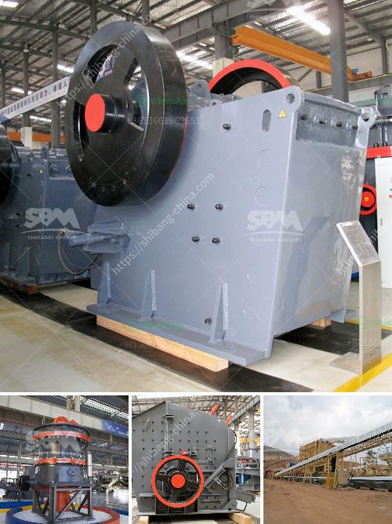

<h3>list mines and quarry owners of malaysia</h3>
Malaysia is endowed with various types of mineral resources, contributing to its status as one of the world's major producers of tin. Despite the country's relatively small size, Malaysia has proven reserves of a wide range of minerals including metallic minerals, non-metallic minerals, and energy minerals. In order to effectively exploit these resources, mines and quarries are established throughout the nation. This article delves into the list of mines and quarry owners in Malaysia, showcasing the key players in this crucial sector.

Rahman Hydraulic Tin is a well-established tin mining company in Malaysia, primarily operating in the Kinta Valley, Perak. With a history dating back more than 50 years, Rahman Hydraulic Tin has gained a reputation for its reliable and efficient tin mining operations. They are one of the major contributors to Malaysia's production of tin.

Sunway Quarry Industries is a leading quarry and asphalt operator in Malaysia, specializing in the quarrying and extraction of aggregates and granites. They have pioneered numerous innovative and sustainable quarrying practices, ensuring the industry's environmental impact remains minimal.

Cimaco Quarry is a reputable mining operator, mainly involved in limestone quarrying. Located in Sabah, East Malaysia, they have been providing high-quality limestone products for various applications, including construction, agriculture, and manufacturing.

Sime Darby Plantation is Malaysia's largest vertically integrated palm oil company. Apart from their oil palm plantations, they also operate palm oil mills and quarries across the country, as palm oil mill by-products and quarries play a crucial role in ensuring the sustainability of the palm oil industry.

With a rich history dating back over 100 years, LafargeHolcim Malaysia is a leading player in the construction materials industry. They operate several quarries nationwide, producing aggregates, cement, and ready-mixed concrete for both local and international markets.

The mines and quarries in Malaysia hold immense significance as they contribute to the nation's economic growth and development. This article provided a glimpse into some of the major mine and quarry owners in Malaysia who have been instrumental in ensuring the sustainable extraction of various mineral resources. These companies play a pivotal role in the country's industrial sector, contributing to the nation's economic prosperity while prioritizing environmental sustainability and responsible mining practices.
<h3>Contact us</h3><ul><li><strong>Whatsapp:&nbsp;<a href="https://wa.me/8613661969651">+8613661969651</a></strong></li><li><a href="https://swt.shibang-china.com/?git&amp;zhl&amp;list mines and quarry owners of malaysia"><strong>Online Service(chat now)</strong></a></li></ul><h3>Related</h3><ul><li><a href='ball mill making from turkey.md'>ball mill making from turkey</a></li><li><a href='what is expected cost of 100 tph crushing plant.md'>what is expected cost of 100 tph crushing plant</a></li><li><a href='stone crusher mobile crusher layout.md'>stone crusher mobile crusher layout</a></li><li><a href='stone crusher mesh size.md'>stone crusher mesh size</a></li><li><a href='second hand stone crusher equipment medium size.md'>second hand stone crusher equipment medium size</a></li></ul>