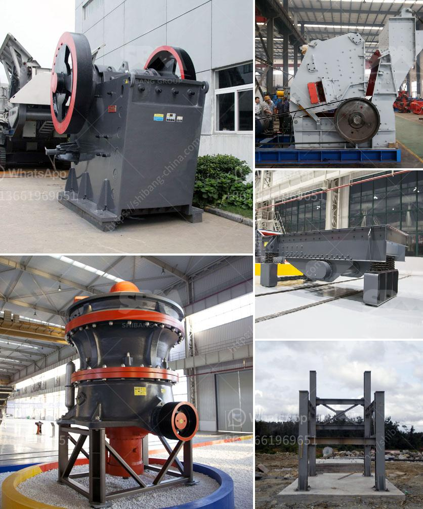

<h3>list of crushers companies in malaysia</h3>
Malaysia is a high-tech enterprise specializing in the research and development and production of stone crushing equipment and industrial mills. It mainly serves customers in Malaysia and also has overseas offices in more than 30 countries and regions. These crushers companies in Malaysia provide customers with high-quality, high-efficiency, and personalized crushing equipment services.

One of the leading crushers companies in Malaysia is Qdex Enterprise. This company offers a wide range of crushing and screening equipment for various industries, such as mining, quarrying, and recycling. Their products include jaw crushers, impact crushers, cone crushers, mobile crushers, and screening plants. With advanced technology and reliable performance, Qdex Enterprise provides solutions to customers' needs, ensuring maximum productivity and efficiency in their operations.

Another notable crushers company in Malaysia is Yifan Machinery. Yifan Machinery is a manufacturer and supplier of stone crushing equipment, specializing in the production of jaw crushers, impact crushers, cone crushers, mobile crushers, and other related equipment. Yifan Machinery's products are widely used in various industries, including mining, construction, and infrastructure. With its innovative design and reliable quality, Yifan Machinery has won the trust and recognition of customers in Malaysia and other countries.

Metso Outotec is also a renowned crushers company in Malaysia. They offer a comprehensive range of crushing and screening equipment, including jaw crushers, cone crushers, impact crushers, and screens. Metso Outotec's solutions are engineered to deliver maximum efficiency, productivity, and reliability. Their products are widely used in the mining, aggregates, recycling, and construction industries.

In addition to the companies mentioned above, there are several other crushers companies operating in Malaysia. These include Terex Corporation, Sandvik Group, FLSmidth & Co. A/S, thyssenkrupp AG, and Metso Corporation. These companies provide a wide range of crushing equipment and services to meet the diverse needs of customers in Malaysia.

Overall, Malaysia has a thriving crushers industry with several reputable companies offering high-quality products and services. These companies are committed to providing innovative solutions, advanced technology, and excellent customer support. Whether it is mining, quarrying, construction, or recycling, the crushers companies in Malaysia are well-equipped to meet the demands of various industries. By investing in reliable crushing equipment, businesses in Malaysia can enhance their productivity and achieve their goals efficiently.
<h3>Contact us</h3><ul><li><strong>Whatsapp:&nbsp;<a href="https://wa.me/8613661969651">+8613661969651</a></strong></li><li><a href="https://swt.shibang-china.com/?git&amp;zhl&amp;list of crushers companies in malaysia"><strong>Online Service(chat now)</strong></a></li></ul><h3>Related</h3><ul><li><a href='gravel crushing equipment.md'>gravel crushing equipment</a></li><li><a href='iron processing plant in mexico.md'>iron processing plant in mexico</a></li><li><a href='grinding mills in pakistan.md'>grinding mills in pakistan</a></li><li><a href='artificaial sand machine germany.md'>artificaial sand machine germany</a></li><li><a href='feldspar powder ball mill.md'>feldspar powder ball mill</a></li></ul>