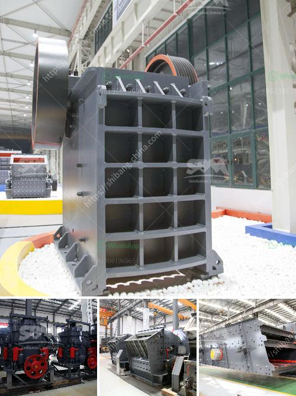

<h3>list of the price of crushing plant turkey</h3>
Turkey, located between Eastern Europe and Western Asia, is known for its diverse cultural heritage, historical sites, and breathtaking landscapes. In recent years, the country has gained prominence as a hub for various industries, including mining and construction. One important sector within these industries is the crushing plant business. The purpose of this article is to provide insights into the price list of crushing plants in Turkey, with detailed information on the costs and factors influencing them.

Crushing plants are vital components of mining and construction projects, delivering a range of materials such as aggregate, limestone, and sand. These plants are designed to break down the extracted materials into smaller, more manageable sizes, ultimately used in various applications such as road construction, building foundations, and concrete production.

Several crucial factors contribute to the price variations of crushing plants in Turkey. It is essential to consider these factors when determining the cost of establishing or purchasing a crushing plant. Some of the key factors include:

a) Size and Capacity: The size and capacity of a crushing plant greatly impact its price. A larger plant generally requires more resources and materials, resulting in increased costs.

b) Technology and Features: The level of automation, control systems, and other innovative features implemented in a crushing plant affects its overall price. Advanced technology and sophisticated features contribute to higher costs.

c) Transport and Logistics: Costs related to transporting the crushing plant and its components play a significant role. Depending on the distance and accessibility of the project site, transportation expenses may vary.

d) Maintenance and Operational Costs: Regular maintenance and operational expenses are important considerations when evaluating the overall price. Quality components and efficient systems may initially increase costs but reduce maintenance expenses in the long run.

The price range of crushing plants in Turkey can vary widely depending on various factors. However, based on market research and industry trends, we can provide a general price range for different crushing plant capacities:

a) Small-Scale Crushing Plants (50-100 tons per hour): The approximate price range for small-scale crushing plants in Turkey is $30,000 to $100,000.

b) Medium-Scale Crushing Plants (100-200 tons per hour): The approximate price range for medium-scale crushing plants is $150,000 to $500,000.

c) Large-Scale Crushing Plants (200-500 tons per hour): The approximate price range for large-scale crushing plants is $500,000 to $2 million.

When considering investments in crushing plants, it is crucial to assess the price range based on the specific requirements of the project. Conducting thorough market research, consulting industry professionals, and evaluating different suppliers can greatly help in making informed decisions. The price list of crushing plants in Turkey provides a comprehensive overview of the costs involved in establishing or purchasing these plants, giving potential investors a clear understanding of the financial aspects of such projects.
<h3>Contact us</h3><ul><li><strong>Whatsapp:&nbsp;<a href="https://wa.me/8613661969651">+8613661969651</a></strong></li><li><a href="https://swt.shibang-china.com/?git&amp;zhl&amp;list of the price of crushing plant turkey"><strong>Online Service(chat now)</strong></a></li></ul><h3>Related</h3><ul><li><a href='diamond stone crusher price list.md'>diamond stone crusher price list</a></li><li><a href='stone crusher 60 to 100 tonnes per hour.md'>stone crusher 60 to 100 tonnes per hour</a></li><li><a href='slag grinding mill.md'>slag grinding mill</a></li><li><a href='limestone crusher china.md'>limestone crusher china</a></li><li><a href='price of gypsum plant machines.md'>price of gypsum plant machines</a></li></ul>