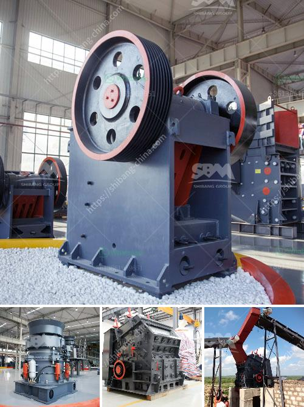

<h3>list of used machines coal mining</h3>
In the world of coal mining, machines are an essential part of the process. This list of used machinery in coal mining showcases the equipment that has been commonly used in the industry.

Drilling machines are used for creating tunnels or drilling holes into the coal seams. These machines are especially important in underground mining, where coal has to be extracted from beneath the surface of the earth. The three most common types of drilling machines used in coal mining are:

Longwall shearers are large machines that are used to cut coal from the walls of a coal seam. They operate by moving back and forth along the coal face, cutting the coal and loading it onto a conveyor belt for transportation to the surface. Longwall shearers are highly efficient and can cut through coal quickly.

Continuous miners are machines with rotating cutting heads that carve into the coal seam. They use a conveyance system to transport the coal away from the face, allowing for continuous mining. These machines are designed to work in tight spaces and can cut through coal efficiently without the need for explosives.

Haul trucks are used to transport coal from the mining site to storage areas or loading points. These trucks are usually massive machines capable of carrying heavy loads of coal. In coal mining, large rigid haul trucks or articulated trucks are often used due to the high volume of material that needs to be moved.

Excavators, also known as diggers or hydraulic excavators, are versatile machines used in coal mining to handle a variety of tasks. They typically have a bucket or scoop attachment that can dig into the ground and extract coal or other materials. Excavators are commonly used to load coal onto trucks or into other equipment for further processing.

Conveyors are used to transport coal from one point to another within the mining operation. They consist of a belt that moves continuously, allowing for efficient transportation of coal over long distances. Conveyors are especially critical in underground mining as they eliminate the need for manual labor to transport coal, improving safety and productivity.

Draglines are massive machines with a large bucket that is used for removing overburden in surface mining operations. They are commonly used in open-pit coal mining to expose the seams and remove the top layers of soil or rock. Draglines are highly efficient and can remove large quantities of overburden in a single scoop.

This list of used machines in coal mining highlights the variety of equipment that is commonly used in this industry. From drilling machines to haul trucks and excavators, each machine plays a crucial role in the extraction and transportation of coal. These machines have greatly improved the efficiency and safety of coal mining operations, allowing for increased production and reduced manual labor. As technology continues to advance, we can expect further innovations in the machinery used in coal mining, making the process even more efficient and environmentally friendly.
<h3>Contact us</h3><ul><li><strong>Whatsapp:&nbsp;<a href="https://wa.me/8613661969651">+8613661969651</a></strong></li><li><a href="https://swt.shibang-china.com/?git&amp;zhl&amp;list of used machines coal mining"><strong>Online Service(chat now)</strong></a></li></ul><h3>Related</h3><ul><li><a href='calcium carbonate making machinery in germany.md'>calcium carbonate making machinery in germany</a></li><li><a href='ore crusher copper ore crusher.md'>ore crusher copper ore crusher</a></li><li><a href='vibrating screen price.md'>vibrating screen price</a></li><li><a href='density of conveyor belts for mining.md'>density of conveyor belts for mining</a></li><li><a href='difference between jaw crusher and cone crusher.md'>difference between jaw crusher and cone crusher</a></li></ul>