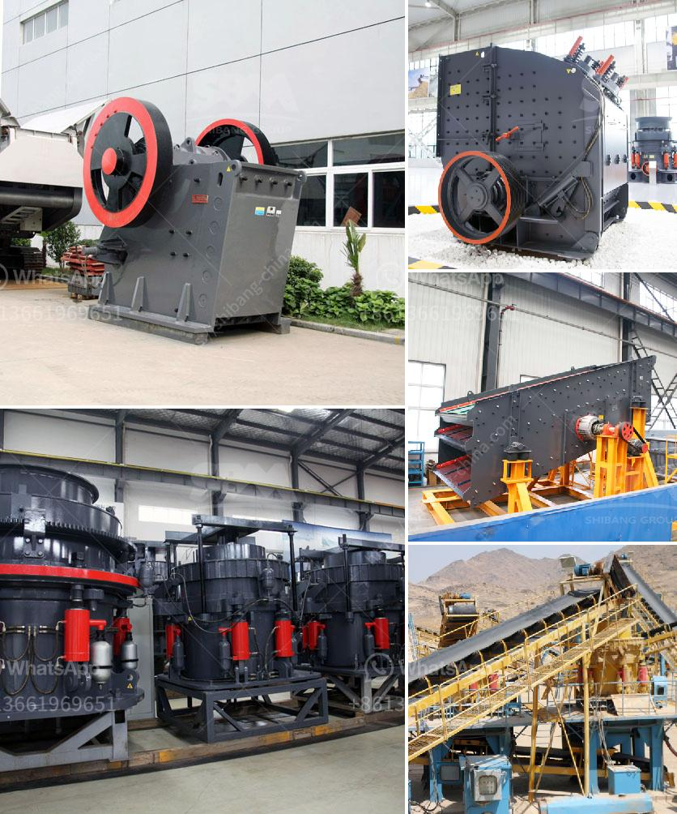

<h3>list the equipment use in diamond mining</h3>
Diamond mining is a complex and intricate process that requires specialized equipment to extract, sort, and transport diamonds effectively. This highly regulated industry revolves around extracting diamonds from deep, open-pit mines, underground mines, alluvial deposits, and offshore marine areas. Let's delve into the equipment used in diamond mining and their importance in this lucrative industry.

First and foremost, diamond mining requires large-scale excavation equipment to remove vast quantities of soil, rocks, and other materials to access the diamond-bearing ore. The main types of excavation equipment used in diamond mining include bulldozers, front-end loaders, and hydraulic shovels. These powerful machines are crucial in removing overburden and providing access to the diamond-rich deposit.

Once the ore has been excavated, it needs to be transported to the processing plant for further sorting and extraction. Conveyors, trucks, and railcars are commonly used for this purpose. Conveyors transfer the ore efficiently from the mining site to the processing plant. Trucks provide a flexible means of transportation, especially in areas with challenging terrain. Railcars are employed in some regions for long-distance haulage, allowing for the efficient movement of large quantities of diamonds.

Sorting and processing the ore is a critical step in diamond mining. Several types of equipment are used to separate diamonds from the surrounding materials. In conventional diamond recovery plants, dense media separation (DMS) plants are commonly used. These plants utilize dense media, usually a mixture of ferrosilicon and water, to create a dense liquid medium with a specific gravity that allows diamonds to sink while lighter materials float. The heavy particles sink to the bottom and are collected, while the lighter waste material is removed.

Another common method for diamond recovery is X-ray sorting technology. X-ray sorting machines use high-resolution X-rays to scan the diamond-bearing ore and detect diamonds based on their atomic density. This advanced technology enables the identification and extraction of diamonds from the ore stream accurately and efficiently.

In recent years, advancements in technology have revolutionized diamond mining even further. Autonomous haul trucks have emerged as a groundbreaking innovation, eliminating the need for human operators and improving safety and productivity. These self-driving trucks can transport the diamond-bearing ore from the mining site to the processing plant, reducing the risk of human error and increasing efficiency.

Diamond mining equipment must also adhere to strict environmental regulations. To ensure sustainable mining operations, equipment such as dust collectors and water treatment systems are employed. Dust collectors mitigate air pollution by capturing fine particulates released during the excavation and processing stages. Water treatment systems treat wastewater and prevent pollution by removing contaminants before discharge.

In conclusion, diamond mining requires a range of specialized equipment to extract, transport, and process diamonds effectively. Excavation equipment removes overburden, providing access to the diamond deposit. Conveyors, trucks, and railcars transport the ore to the processing plant, where sorting equipment such as dense media separation and X-ray sorters separate diamonds from the surrounding materials. Advancements in technology, such as autonomous haul trucks, have further improved efficiency and safety in diamond mining. Additionally, the industry's commitment to environmental sustainability is evident in the use of equipment such as dust collectors and water treatment systems. Overall, the equipment used in diamond mining plays a crucial role in ensuring the success and sustainability of this highly valuable industry.
<h3>Contact us</h3><ul><li><strong>Whatsapp:&nbsp;<a href="https://wa.me/8613661969651">+8613661969651</a></strong></li><li><a href="https://swt.shibang-china.com/?git&amp;zhl&amp;list the equipment use in diamond mining"><strong>Online Service(chat now)</strong></a></li></ul><h3>Related</h3><ul><li><a href='ballast crushing machine in kenya.md'>ballast crushing machine in kenya</a></li><li><a href='roller mill working.md'>roller mill working</a></li><li><a href='stone quarry machines for sale.md'>stone quarry machines for sale</a></li><li><a href='domestic mobile crusher.md'>domestic mobile crusher</a></li><li><a href='nigeria jaw crusher.md'>nigeria jaw crusher</a></li></ul>