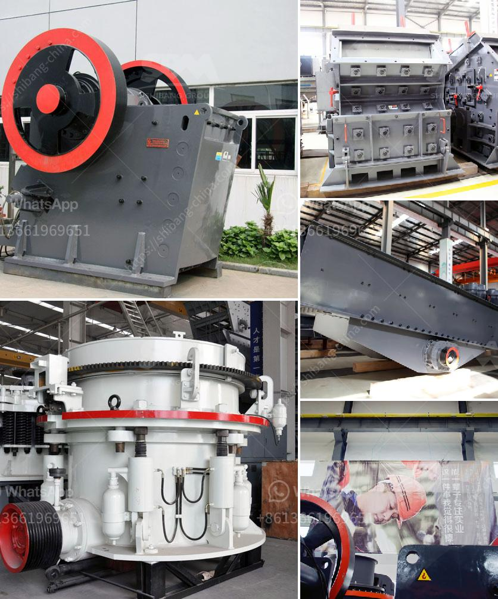

<h3>lm vertical grinding mill</h3>
The LM vertical grinding mill is a high-quality product manufactured by the mining machinery company Zenith. It is a grinding equipment with advanced technology, and has the features of wide application, high grinding efficiency, low energy consumption, and stable operation.

The LM vertical grinding mill integrates crushing, drying, grinding, grading, and conveying. It can grind various materials including coal, cement raw materials, clinker, power plant desulfurization limestone powder, slag powder, manganese ore, gypsum, coal, barite, calcite, bauxite, and others. With the development of the industrial economy, the market demand for the LM vertical grinding mill has continuously increased.

The LM vertical grinding mill uses a special grinding roller linkage hydraulic system, which can automatically lubricate the lubrication parts of the equipment, while also effectively controlling the temperature of the equipment. The hydraulic system also removes impurities from the oil, ensuring the stable operation of the equipment and prolonging its service life.

The grinding roller and grinding disc of the LM vertical grinding mill are designed with replaceable wear-resistant lining plates. Once the lining plates are worn out, they can be replaced, which greatly reduces the maintenance cost of the equipment. The wear-resistant materials used in the lining plates are of high quality and have a long service life, which effectively improves the overall performance of the equipment.

Another feature of the LM vertical grinding mill is the intelligent control system. The system can monitor the operation of the equipment in real-time, collect data, and adjust the operation parameters in time to ensure the stable and efficient operation of the equipment. The intelligent control system also has functions such as fault diagnosis and alarm, which effectively improves the safety and reliability of the equipment.

In addition to its high grinding efficiency, the LM vertical grinding mill has a low energy consumption. The power consumption of the equipment is only 30% to 40% of that of the traditional ball mill or Raymond mill. It not only saves energy but also reduces carbon emissions, contributing to the sustainable development of the environment.

In conclusion, the LM vertical grinding mill is a highly efficient and environmentally friendly grinding equipment. It has a wide range of applications, high grinding efficiency, low energy consumption, and stable operation. With the continuous improvement and innovation of technology, the LM vertical grinding mill will continue to provide high-quality grinding solutions for various industries.
<h3>Contact us</h3><ul><li><strong>Whatsapp:&nbsp;<a href="https://wa.me/8613661969651">+8613661969651</a></strong></li><li><a href="https://swt.shibang-china.com/?git&amp;zhl&amp;lm vertical grinding mill"><strong>Online Service(chat now)</strong></a></li></ul><h3>Related</h3><ul><li><a href='gold stone crusher machine south africa.md'>gold stone crusher machine south africa</a></li><li><a href='sayaji jaw crusher x specifiion.md'>sayaji jaw crusher x specifiion</a></li><li><a href='grinding mills in usa.md'>grinding mills in usa</a></li><li><a href='sand manufacturing plant.md'>sand manufacturing plant</a></li><li><a href='ball mill hammer mill roller mill machine.md'>ball mill hammer mill roller mill machine</a></li></ul>