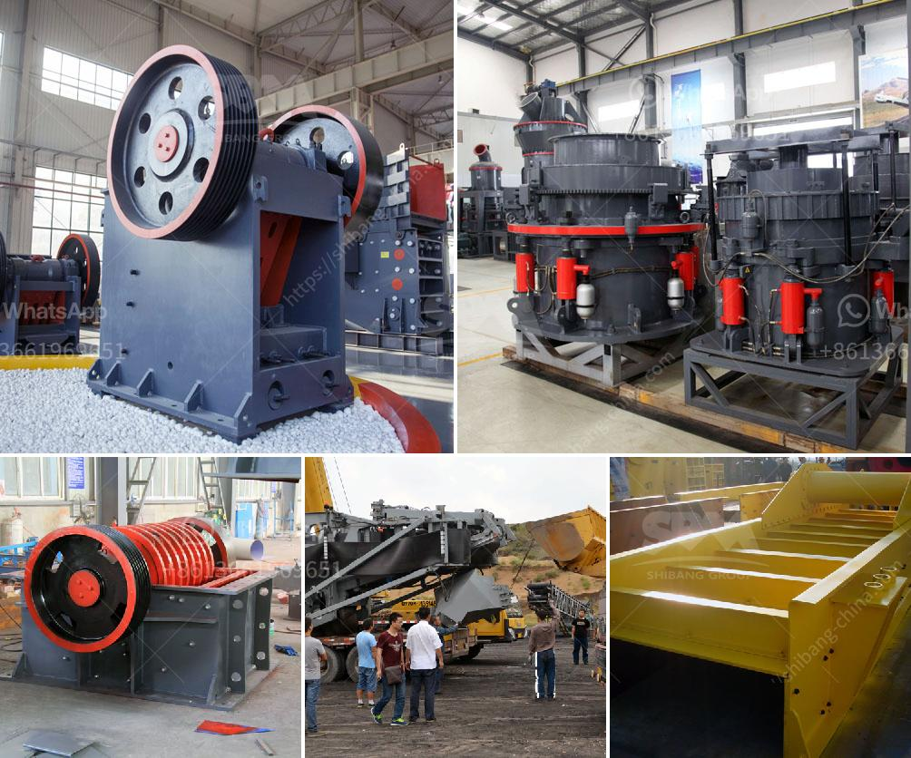

<h3>location of grinding mills in usa</h3>
The location of grinding mills in the United States plays a crucial role in supporting various industries. Grinding mills are essential equipment used in processing raw materials and transforming them into fine powders or particles. They are commonly utilized in the agricultural, chemical, and mining sectors to grind materials like grains, chemicals, minerals, and ores.

The choice of location for grinding mills is influenced by several factors, including accessibility to raw materials, proximity to customers, and logistical considerations. Let's explore these factors in more detail.

One key factor that determines the location of grinding mills is the availability of raw materials. In the agricultural industry, grinding mills are often established close to crop-growing regions to ensure a steady supply of grains. States such as Kansas, Iowa, and Nebraska, which are known for their extensive agricultural output, have numerous grinding mills catering to the local farming communities.

Similarly, in the mining and mineral processing industry, grinding mills are strategically located near mining sites where minerals are extracted. States like Nevada, Colorado, and Utah, abundant in mineral resources, have numerous grinding mills to process ores such as gold, silver, and copper. Proximity to mining operations allows for cost-effective transportation of raw materials, reducing logistical expenses.

The proximity to customers is another crucial aspect considered when locating grinding mills. Industries that heavily rely on grinding mills, such as the chemical and pharmaceutical sectors, prefer to have mills situated close to their manufacturing facilities. This ensures a timely supply of finely ground materials required for their production processes. States like New Jersey, Ohio, and Pennsylvania, which have a strong presence in the chemical industry, are home to several grinding mills.

Logistical considerations are also key drivers in locating grinding mills. The transportation of raw materials and finished products is an important consideration to reduce costs and increase efficiency. Well-connected states with efficient transportation networks, such as Texas, Illinois, and California, are favored locations for grinding mills. Easy access to highways, railways, and ports facilitates the movement of raw materials and finished products to and from the mills.

In recent years, there has also been a growing focus on sustainable practices and environmental considerations in the location of grinding mills. Several mills are being established in states actively promoting renewable energy sources like wind or solar power. This allows mills to harness clean energy for their operations, reducing their carbon footprint and aligning with the sustainability goals of various industries.

In conclusion, the location of grinding mills in the United States is determined by factors such as access to raw materials, proximity to customers, logistical considerations, and sustainable practices. States with abundant agricultural output or mineral resources tend to have a higher concentration of grinding mills. Proximity to customers ensures a steady supply of finely ground materials for industries, while efficient transportation networks play a vital role in reducing costs. As industries continue to evolve, the location of grinding mills will continue to adapt to changing requirements and environmental considerations.
<h3>Contact us</h3><ul><li><strong>Whatsapp:&nbsp;<a href="https://wa.me/8613661969651">+8613661969651</a></strong></li><li><a href="https://swt.shibang-china.com/?git&amp;zhl&amp;location of grinding mills in usa"><strong>Online Service(chat now)</strong></a></li></ul><h3>Related</h3><ul><li><a href='small cement grinding machine.md'>small cement grinding machine</a></li><li><a href='ball mill mesh output.md'>ball mill mesh output</a></li><li><a href='conveyor belts in coal transport sizing.md'>conveyor belts in coal transport sizing</a></li><li><a href='feldspar powder ball mill.md'>feldspar powder ball mill</a></li><li><a href='chrome washing plant in limpopo for rent.md'>chrome washing plant in limpopo for rent</a></li></ul>