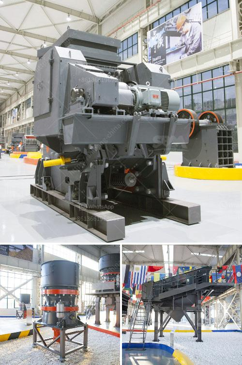

<h3>looking for hammer mill</h3>
If you are in the market for a hammer mill, you are likely aware that it is an essential piece of equipment in various industries. Perfect for grinding, crushing, or pulverizing a wide range of materials, a hammer mill is especially useful in demolishing structures and processing grains, herbs, and even waste materials. However, with so many options available, finding the right hammer mill can be a daunting task. To help you navigate through the selection process, consider the following factors before making a purchase.

1. Purpose and Material to be Processed: Understanding the purpose of your hammer mill is the first step towards finding the right one. Are you planning to use it for commercial purposes or personal use? Will you be crushing wood, grains, or agricultural materials? Different hammer mills are designed for specific applications. Therefore, determining what you will be using it for and the material you will be processing will guide you towards the most suitable hammer mill.

2. Capacity and Speed: Hammer mills have various capacities, measured in terms of output, which is usually presented in pounds per hour (lb/hr). Assess the amount of material you will need to process within a given timeframe and select a hammer mill with a capacity that meets your needs. Additionally, consider the rotational speed (RPM) of the mill as it directly affects the efficiency of material processing. Higher RPMs often result in finer materials, while lower RPMs may be more suitable for processing larger or tougher materials.

3. Size and Portability: Depending on the available space in your facility and your need for mobility, the size and portability of the hammer mill may be crucial. Measure the available space to ensure the mill fits and consider whether it needs to be portable or stationary. Portable hammer mills are often designed with wheels for easy movement between work areas.

4. Power Source: Hammer mills can be powered by electricity, diesel, or gasoline engines. Consider the power source that suits your requirements and the availability of that fuel in your area. Electrical-powered hammer mills are often more convenient and economical if there is a reliable power supply. However, if you require mobility or if electricity is limited, gas or diesel-powered mills are more suitable.

5. Maintenance and Durability: Ensure that the hammer mill you choose is made from high-quality material and with sturdy construction. Look for mills made from durable metals like stainless steel or cast iron, as they are less prone to damage and wear. Additionally, consider the ease of maintenance, as regular upkeep ensures the longevity of your hammer mill.

6. Cost and Warranty: Lastly, consider the cost and warranty associated with the hammer mill. Compare prices from different manufacturers or suppliers to ensure you are getting a fair price for the features and specifications you require. Additionally, check if the manufacturer provides warranties or guarantees, as this can provide peace of mind and protection against any potential defects or issues.

In conclusion, finding the right hammer mill requires careful consideration of its purpose, the material to be processed, its capacity and speed, size and portability, power source, maintenance needs, and cost. By taking these factors into account, you can make an informed decision and find the perfect hammer mill to meet your requirements.
<h3>Contact us</h3><ul><li><strong>Whatsapp:&nbsp;<a href="https://wa.me/8613661969651">+8613661969651</a></strong></li><li><a href="https://swt.shibang-china.com/?git&amp;zhl&amp;looking for hammer mill"><strong>Online Service(chat now)</strong></a></li></ul><h3>Related</h3><ul><li><a href='crusher stone price.md'>crusher stone price</a></li><li><a href='impact crusher machine.md'>impact crusher machine</a></li><li><a href='trommel screen suppliers in india.md'>trommel screen suppliers in india</a></li><li><a href='economic analysis of conveyor system.md'>economic analysis of conveyor system</a></li><li><a href='project report for starting a crusher plant in tamilnadu.md'>project report for starting a crusher plant in tamilnadu</a></li></ul>