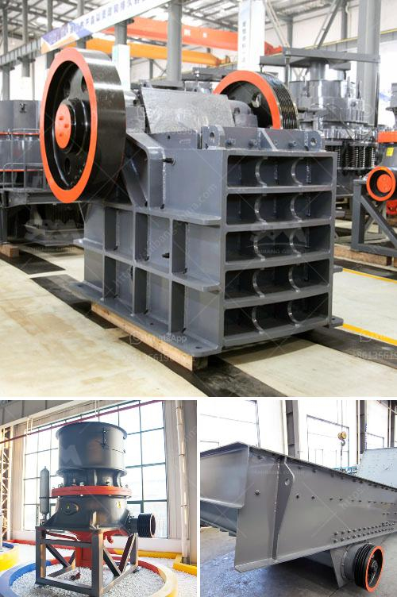

<h3>looking for kaolin processing price</h3>
Are you in the market for kaolin processing? If so, it's important to understand the factors that determine the price of this versatile mineral. Kaolin, also known as China clay, is a white clay predominantlUsually extracted through open-pit mining, kaolin can be further processed to enhance its value and uses. From porcelain and ceramic production to the paper, paint, and rubber industries, kaolin is a critical ingredient.

When it comes to looking for kaolin processing price, several factors come into play. The quality and purity of the kaolin deposit plays a significant role in determining its value. High-quality deposits with low impurities command higher prices in the market due to their superior performance in different applications.

Another crucial consideration is the processing method utilized. Different processing techniques, such as physical or chemical beneficiation, result in varying levels of product quality and cost. Processing kaolin is an intricate process that involves crushing, drying, and grinding the raw material to achieve the desired consistency. The machinery used for these processes and the energy consumed in the process can influence pricing.

Transportation costs also affect the overall price of kaolin processing. The proximity of the kaolin deposit to the processing site can significantly impact transportation expenses. Additionally, transportation costs may vary depending on the market demand and availability of suitable transportation infrastructure, such as railways or ports.

Market conditions and competition can also influence the price of kaolin processing. Depending on supply and demand dynamics, prices may fluctuate. Additionally, competition among suppliers can create price competitiveness as they strive to offer the best value for customers.

Lastly, it is paramount to consider the reputation and expertise of the kaolin processing company. Experienced and reputable processors often charge a premium for their services due to their extensive knowledge, advanced equipment, and commitment to quality control.

In conclusion, when looking for kaolin processing prices, one needs to consider various factors such as the quality of the deposit, processing methods, transportation costs, market conditions, and the reputation of the processing company. By taking these factors into account, customers can make informed decisions and find the best value for their kaolin processing needs.
<h3>Contact us</h3><ul><li><strong>Whatsapp:&nbsp;<a href="https://wa.me/8613661969651">+8613661969651</a></strong></li><li><a href="https://swt.shibang-china.com/?git&amp;zhl&amp;looking for kaolin processing price"><strong>Online Service(chat now)</strong></a></li></ul><h3>Related</h3><ul><li><a href='mobile crusher plant south africa.md'>mobile crusher plant south africa</a></li><li><a href='talcum powder grinding machine in kerala.md'>talcum powder grinding machine in kerala</a></li><li><a href='stone company profile in china.md'>stone company profile in china</a></li><li><a href='ballast crusher equipment.md'>ballast crusher equipment</a></li><li><a href='kenya roller mill.md'>kenya roller mill</a></li></ul>