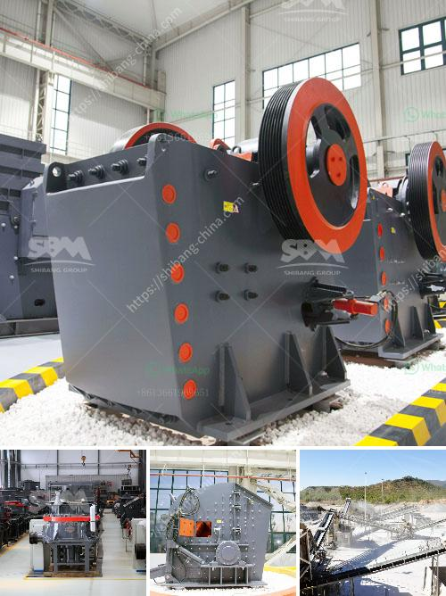

<h3>looking for used pulverizer machine</h3>
Are you in the market for a used pulverizer machine? Whether you're a business owner looking to expand your operations or a DIY enthusiast in need of heavy-duty equipment, finding the right machine at an affordable price can be a challenge. However, with a bit of research and patience, you can easily find a used pulverizer machine that meets your needs. In this article, we will explore the steps to take when searching for a used pulverizer machine and some factors to consider during the process.

First and foremost, it is essential to determine your specific requirements. What materials do you intend to pulverize? What is your desired output capacity? Understanding these factors will help you narrow down your options and focus on machines that are best suited for your needs. Additionally, consider the space available in your facility or workspace to ensure the machine fits comfortably without causing any hindrance to other operations.

Once you have a clear idea of your requirements, it's time to start the search. The internet is a valuable resource that can connect you with numerous sellers and platforms specializing in used equipment. Conduct a thorough online search, browse reputable auction sites, and explore classified ads. These platforms often have detailed descriptions, specifications, and images to help you get a better understanding of the pulverizer machines available.

While browsing through listings, pay close attention to the machine's condition. Look for detailed information about its age, maintenance history, and any repairs or upgrades it has undergone. A well-maintained and regularly serviced pulverizer machine is likely to provide better performance and durability. Some online platforms also allow you to contact the seller directly, so don't hesitate to ask for additional information or request a demonstration if possible.

Another important consideration is the warranty or guarantee offered with the used machine. Reputable sellers often provide some form of warranty to ensure buyer satisfaction and protect against unexpected breakdowns. While used equipment may not come with the same warranty as a new machine, a limited warranty can provide peace of mind and safeguard your investment.

Price comparison is crucial when looking for a used pulverizer machine. It's recommended to compare prices across different platforms and sellers to get an idea of the average market value. Be cautious of deals that seem too good to be true, as extremely low prices may indicate hidden defects or inadequate maintenance. Remember, while it's important to find a machine within your budget, it's equally important to invest in a reliable machine that will last.

In addition to the price, consider the availability of spare parts and ongoing maintenance support. Research the brand and model of the pulverizer machine you're interested in to ensure that replacement parts are readily available. Choosing a well-known brand might provide easier access to affordable and genuine spare parts, minimizing downtime and maintenance costs.

Lastly, don't rush into a purchase. Take your time to evaluate multiple options, compare specifications and prices, and ask questions. If possible, consider visiting the seller's location to inspect the machine in person before finalizing the deal. Seeing the machine firsthand can help you assess its condition and functionality accurately.

In conclusion, finding a used pulverizer machine requires careful research, thorough evaluation, and patience. By determining your specific needs, searching through reliable platforms, and considering factors such as condition, warranty, price, and availability of spare parts, you can find a cost-effective and reliable pulverizer machine that will meet your requirements. Remember, a well-informed decision will ensure that your investment in a used pulverizer machine pays off in the long run.
<h3>Contact us</h3><ul><li><strong>Whatsapp:&nbsp;<a href="https://wa.me/8613661969651">+8613661969651</a></strong></li><li><a href="https://swt.shibang-china.com/?git&amp;zhl&amp;looking for used pulverizer machine"><strong>Online Service(chat now)</strong></a></li></ul><h3>Related</h3><ul><li><a href='gravel making equipment.md'>gravel making equipment</a></li><li><a href='fly ash grinding mill.md'>fly ash grinding mill</a></li><li><a href='stone crushers in belen.md'>stone crushers in belen</a></li><li><a href='rental crusher rinda.md'>rental crusher rinda</a></li><li><a href='nepal jaw crusher or sale.md'>nepal jaw crusher or sale</a></li></ul>