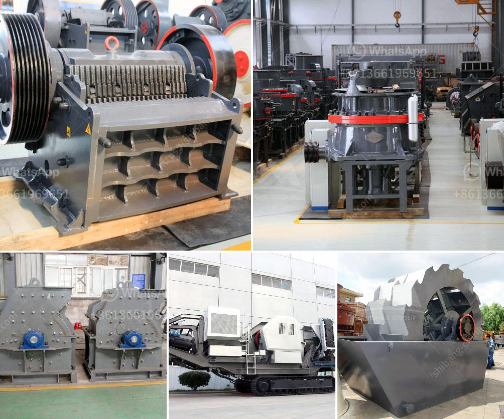

<h3>low cost jaw crusher for sale in ethiopia</h3>
Jaw crushers are versatile machines used for crushing and reducing rocks, ores, and other materials into smaller sizes. They are widely used in mining, construction, and recycling industries. Due to their low cost and high efficiency, jaw crushers are being used by various industries to crush different materials.

Over the years, the demand for jaw crushers has increased in Ethiopia, with advancements in technology, creating more efficient systems to crush rocks. These machines are highly durable and can withstand the harsh conditions of any construction site, making it a perfect solution for low-cost crushing equipment.

One of the most popular jaw crusher types is the Blake jaw crusher. It has a fixed jaw and a movable jaw pivoted at the top. The crushing chamber is made of two plates, called jaws, where the rocks are being crushed. Blake jaw crushers are known for their reliability, efficiency, and long-lasting performance.

1. Cost-Effective: The low cost of jaw crushers in Ethiopia makes them a great investment for any construction or mining project. This is because the operating costs are relatively low, as there is no need for additional machinery or manpower.

2. Compact Design: A jaw crusher in Ethiopia is of compact and simple design which allows for easy operation and maintenance. This ensures high productivity and low downtime.

3. Reliable and Efficient: Jaw crushers in Ethiopia have several notable features such as high capacity, reliable performance, and long service life. Once the primary crushing is done, the material is transported to the secondary and tertiary crushing stages. This ensures high productivity and quality in the final product.

4. Versatility: Jaw crushers in Ethiopia can crush almost any material, including concrete, asphalt, glass, coal, metallic, and non-metallic rocks. The capability of crushing multiple materials makes the machine suitable for recycling applications.

5. Efficient Handling of Materials: Primary crushing of large materials requires a jaw crusher, which can be operated at high capacity to process the materials efficiently. Additionally, portable jaw crushers provide flexibility in moving material within different locations.

In conclusion, jaw crushers are a valuable asset to any construction or mining site in Ethiopia. They offer a cost-effective solution and ensure high productivity and quality in the final product. With attention to detail and continuous improvement, jaw crushers have remained the preferred choice for crushing operations in various industries.

If you are considering investing in a jaw crusher in Ethiopia, it is essential to choose a reliable supplier to ensure high-quality equipment that meets your specific needs. Make sure to evaluate the features, performance, and after-sales support provided by the supplier before making a purchase. This will ensure that your investment is well-protected and that you receive the best value for your money.
<h3>Contact us</h3><ul><li><strong>Whatsapp:&nbsp;<a href="https://wa.me/8613661969651">+8613661969651</a></strong></li><li><a href="https://swt.shibang-china.com/?git&amp;zhl&amp;low cost jaw crusher for sale in ethiopia"><strong>Online Service(chat now)</strong></a></li></ul><h3>Related</h3><ul><li><a href='quartz grinding machine cost.md'>quartz grinding machine cost</a></li><li><a href='stone crushing in mineral processing.md'>stone crushing in mineral processing</a></li><li><a href='cone crushers for sale in philippines.md'>cone crushers for sale in philippines</a></li><li><a href='dolomite crushing production line equipment.md'>dolomite crushing production line equipment</a></li><li><a href='sand crusher machine hyderabad for sale.md'>sand crusher machine hyderabad for sale</a></li></ul>