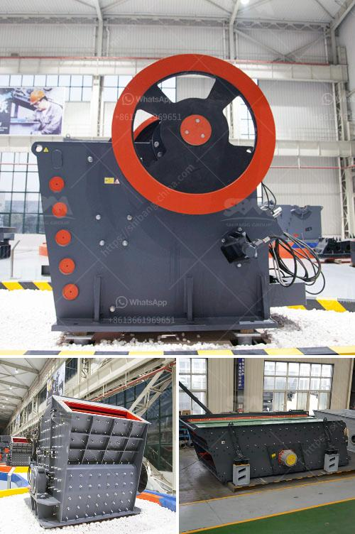

<h3>lsx sand washing machine</h3>
The LSX sand washing machine is a reliable and efficient piece of equipment for washing and dewatering sand. It is designed with an advanced washing technology to remove dirt and impurities from sand particles and improve the quality of the sand.

One of the key features of the LSX sand washing machine is its spiral sand washing system, where the spiral blades are used to scrub and clean the sand. This ensures that all the impurities are removed, leaving behind clean and high-quality sand.

The machine also has a dewatering screen that helps in reducing the moisture content in the sand. This is essential as excess moisture can lead to clumping and poor-quality sand. With the LSX sand washing machine, users can ensure that the sand is well-dewatered and ready for use in various applications.

The LSX sand washing machine is not only efficient but also user-friendly. It comes with a simple and intuitive control panel that allows users to adjust the washing and dewatering parameters according to their requirements. This makes it easy for operators to achieve the desired results.

Moreover, the LSX sand washing machine is built with high-quality materials that can withstand the harsh conditions of the washing process. This ensures that the machine remains durable and reliable even after prolonged use.

In conclusion, the LSX sand washing machine is a highly efficient and reliable equipment for washing and dewatering sand. Its advanced washing technology, user-friendly interface, and durable construction make it an ideal choice for sand washing applications. Whether it is used in construction, mining, or other industries, the LSX sand washing machine ensures that the sand is clean, high-quality, and ready for use.
<h3>Contact us</h3><ul><li><strong>Whatsapp:&nbsp;<a href="https://wa.me/8613661969651">+8613661969651</a></strong></li><li><a href="https://swt.shibang-china.com/?git&amp;zhl&amp;lsx sand washing machine"><strong>Online Service(chat now)</strong></a></li></ul><h3>Related</h3><ul><li><a href='cost of stone crusher in nigeria.md'>cost of stone crusher in nigeria</a></li><li><a href='method statement of installation conveyor belt.md'>method statement of installation conveyor belt</a></li><li><a href='jaw crusher di indonesia.md'>jaw crusher di indonesia</a></li><li><a href='rock crusher 500 cubic metre per day.md'>rock crusher 500 cubic metre per day</a></li><li><a href='standard conveyor belts.md'>standard conveyor belts</a></li></ul>