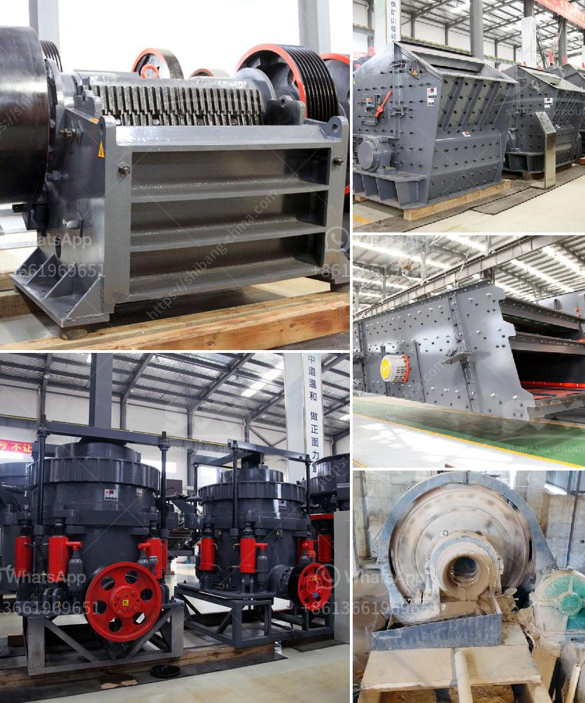

<h3>m sand crusher in district</h3>
M sand (Manufactured Sand) crusher is undoubtedly a great alternative for river sand as it fosters sustainable development. It is produced by crushing hard granite rocks, which are easily available in the region, to obtain cubically shaped aggregate particles. M sand is ideal for construction purposes as it offers greater strength and durability compared to natural sand. In this article, we will delve into the benefits and applications of M sand crusher in the district.

In recent years, the demand for sand has skyrocketed due to rapid urbanization and infrastructure development. However, the indiscriminate mining of river sand has led to environmental degradation and depletion of river beds. This has necessitated the need for an alternative, and M sand has emerged as a viable solution. M sand crusher has gained popularity as it can be produced at a much faster rate compared to river sand, which can take centuries to form naturally.

One of the key advantages of M sand crusher is its consistency in quality. The crushing process ensures that the granules are uniform in size, shape, and texture. This makes M sand crusher ideal for use in high-strength concrete, coastal construction, and other critical infrastructural projects. Moreover, the controlled manufacturing process ensures that M sand is free from impurities, such as silt and clay, which can hinder the performance of concrete.

Another advantage of M sand crusher is its cost-effectiveness. Since it can be produced locally, transportation costs are significantly reduced. Additionally, M sand crusher does not require extensive processing like river sand, which involves washing, grading, and removing impurities. This results in lower production costs and ultimately leads to more affordable construction materials.

The versatility of M sand crusher is another reason why it is preferred in the construction industry. It can be used for various applications, including masonry, plastering, and concrete works. Its fine aggregate particles ensure better workability and bonding. Moreover, M sand crusher can be customized to meet specific requirements, such as grading and particle size, making it suitable for a wide range of construction projects.

In the district, the adoption of M sand crusher has been steadily increasing. Construction companies, contractors, and builders have recognized the benefits it offers and are actively using it in their projects. This not only ensures the availability of a sustainable construction material but also reduces the dependency on river sand and protects the environment.

To facilitate the production of M sand crusher, several crusher units have been established in the district. These units utilize state-of-the-art machinery and technology to crush hard rocks into fine granules. However, it is important to ensure that these crusher units operate in line with environmental regulations and follow sustainable mining practices.

In conclusion, the use of M sand crusher in the district is a commendable step towards sustainable development. It not only addresses the problem of sand scarcity but also offers numerous advantages, such as greater strength, consistency, and cost-effectiveness. With proper regulation and oversight, the adoption of M sand crusher can promote a greener and more sustainable construction industry in the district, ensuring a brighter future for generations to come.
<h3>Contact us</h3><ul><li><strong>Whatsapp:&nbsp;<a href="https://wa.me/8613661969651">+8613661969651</a></strong></li><li><a href="https://swt.shibang-china.com/?git&amp;zhl&amp;m sand crusher in district"><strong>Online Service(chat now)</strong></a></li></ul><h3>Related</h3><ul><li><a href='ballast crusher equipment.md'>ballast crusher equipment</a></li><li><a href='stone crushers in belen.md'>stone crushers in belen</a></li><li><a href='aggregate crusher types.md'>aggregate crusher types</a></li><li><a href='chinese jaw crusher.md'>chinese jaw crusher</a></li><li><a href='cement production machinery.md'>cement production machinery</a></li></ul>