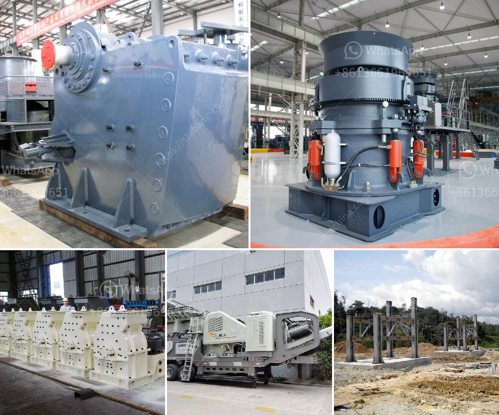

<h3>machine for gypsum factory from philippines</h3>
The construction industry has witnessed remarkable advancements in recent years, thanks to the emergence of innovative machines. One such machine that has revolutionized gypsum production is the machine for gypsum factory from the Philippines.

Gypsum, a mineral widely used in construction, is known for its fire-resistant and soundproof properties. It has become a preferred building material among architects and contractors worldwide. However, processing and manufacturing gypsum boards or plaster of Paris can be a labor-intensive task.

The machine for gypsum factory from the Philippines has changed the game entirely. With its state-of-the-art technology and automated processes, it has made gypsum production faster, more efficient, and cost-effective. This machine consists of various components, including a crusher, mill, conveyor, dust collector, and packaging machine, all integrated seamlessly to create a streamlined production line.

The machine starts with the crushing process, where raw gypsum stones are pulverized into smaller particles. These particles are then fed into the mill, where they are mixed with water to form a slurry. This slurry is poured onto a conveyor belt that transports it through a series of drying chambers. The hot air in these chambers evaporates the excess water, leaving behind solid gypsum boards or plaster of Paris.

One of the key advantages of the machine for gypsum factory from the Philippines is its impressive production capacity. It can produce thousands of high-quality gypsum boards or plaster of Paris in a single day, meeting the demands of large-scale construction projects. Moreover, the automated processes reduce the need for manual labor, resulting in faster production and lower labor costs.

Additionally, the machine for gypsum factory from the Philippines ensures consistent quality throughout the production cycle. The precise control of temperature and humidity prevents any variations in the final product, guaranteeing uniformity and reliability. This is crucial for construction projects that require gypsum with specific properties.

The machine for gypsum factory from the Philippines has undoubtedly transformed the construction industry. Its efficiency, cost-effectiveness, and high-quality output have made it a valuable asset for gypsum manufacturers worldwide. With the demand for gypsum products on the rise, this machine has played a pivotal role in meeting industry requirements.

As the construction industry continues to evolve, it is vital to embrace technological advancements like the machine for gypsum factory from the Philippines. By integrating innovative machines into manufacturing processes, the industry can improve productivity, reduce costs, and meet the growing demands of modern construction projects.
<h3>Contact us</h3><ul><li><strong>Whatsapp:&nbsp;<a href="https://wa.me/8613661969651">+8613661969651</a></strong></li><li><a href="https://swt.shibang-china.com/?git&amp;zhl&amp;machine for gypsum factory from philippines"><strong>Online Service(chat now)</strong></a></li></ul><h3>Related</h3><ul><li><a href='quarry crusher equipment supplier.md'>quarry crusher equipment supplier</a></li><li><a href='machines for stone crushing from poland.md'>machines for stone crushing from poland</a></li><li><a href='crusher for bed ash manufacturers.md'>crusher for bed ash manufacturers</a></li><li><a href='crusher stone plant limpopo.md'>crusher stone plant limpopo</a></li><li><a href='mobile aggregate crusher.md'>mobile aggregate crusher</a></li></ul>