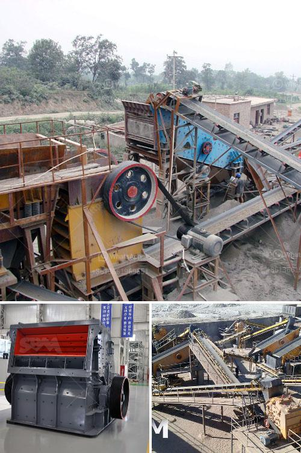

<h3>machine for production of stone gravel crusher</h3>
A stone gravel crusher machine is often used in construction projects and road construction. The machine can break down large rocks into smaller pieces, ensuring the gravel can be used for various purposes such as for making concrete or as a base for roads.

One of the most common types of pulverizers, crushers are typically used to reduce the size of large rocks, changing them into more easily-handled small rocks, rock dust, or gravel. Crushers are able to break apart or compress soft materials such as limestone, gypsum, and phosphate, to very hard materials such as ore and asphalt.

There are many different types of crushers available, each with its own characteristics and abilities, and each can work in specific operating conditions. One popular choice is the jaw crusher, which is often used in the primary crushing stage. Other common techniques include cone crushers and impact crushers, which can also be used for intermediate and fine crushing applications.

Depending on the types of materials being processed, the size of the required output, and the desired final product shape and size, crushers can be customized to fit specific production requirements. For example, a vertical shaft impact crusher can be used for shaping stone particles into a cubical shape with a consistent size, making it ideal for producing high-quality aggregates for construction applications.

When searching for a stone gravel crusher machine, one of the most important considerations is the machine's power. It is recommended to choose a machine that can operate within the range of 100 to 300 horsepower; this ensures that the crusher can handle even the most demanding projects.

In addition to power, the crushers should be equipped with reliable and durable wear parts, such as jaw plates and liners, to minimize down time and maximize efficiency. Regular maintenance and proper lubrication are also crucial to keeping the machine running smoothly and extending its lifespan.

Overall, a stone gravel crusher machine is necessary for a construction project. Choosing the right type of machine is critical for the success of the project, as well as for getting the desired final product in the most cost-effective way possible.
<h3>Contact us</h3><ul><li><strong>Whatsapp:&nbsp;<a href="https://wa.me/8613661969651">+8613661969651</a></strong></li><li><a href="https://swt.shibang-china.com/?git&amp;zhl&amp;machine for production of stone gravel crusher"><strong>Online Service(chat now)</strong></a></li></ul><h3>Related</h3><ul><li><a href='impact crushers for sale in usa.md'>impact crushers for sale in usa</a></li><li><a href='type of conveyors belt pdf.md'>type of conveyors belt pdf</a></li><li><a href='silicon wafer crusher.md'>silicon wafer crusher</a></li><li><a href='feldspar stone for sale india.md'>feldspar stone for sale india</a></li><li><a href='salt crusher plant process price.md'>salt crusher plant process price</a></li></ul>