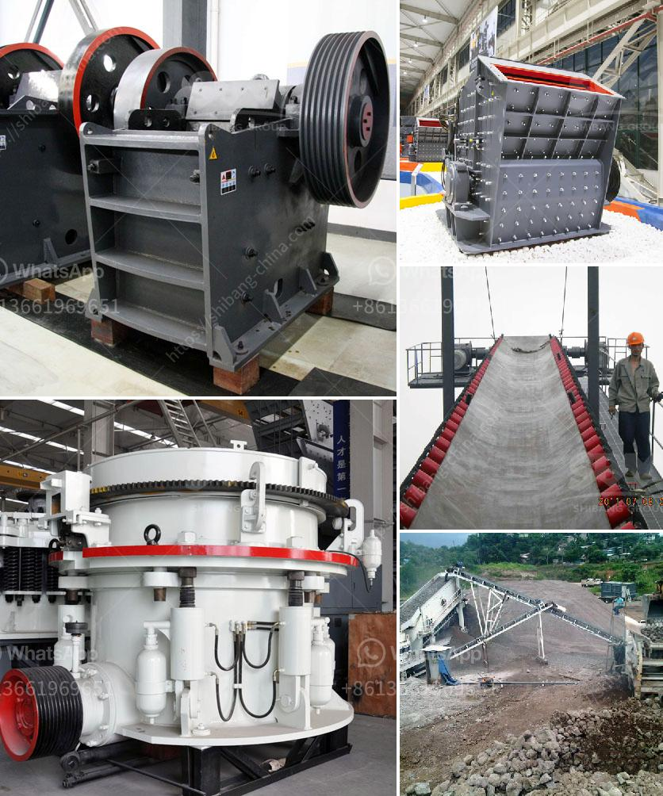

<h3>machine layout gypsum board manufacturing</h3>
Gypsum board, also known as drywall or plasterboard, is a widely used construction material known for its durability, versatility, and ease of installation. It is manufactured by combining gypsum powder, water, and additives to create a uniform mixture which is then sandwiched between two layers of paper. As the demand for gypsum board continues to rise, efficient manufacturing processes become crucial. In this article, we will discuss the machine layout for gypsum board manufacturing, focusing on key considerations and best practices.

The machine layout for gypsum board manufacturing involves several key steps, including material preparation, forming, drying, trimming, and packaging. To ensure maximum efficiency and productivity, it is important to carefully plan the layout of the machines and equipment involved. Here are some key considerations to take into account:

1. Space utilization: Optimal space utilization is crucial to maximize production capacity and minimize material handling. It is important to have a clear understanding of the available space and plan the layout accordingly. Minimizing the distance between machines and establishing an efficient workflow can significantly reduce operator fatigue and improve overall efficiency.

2. Workflow optimization: A well-designed machine layout should facilitate a smooth and logical flow of materials and personnel. The production line should be organized in a manner that minimizes material handling and reduces the risk of bottlenecks or delays. By aligning processes in a sequential order, from material preparation to packaging, the overall productivity can be greatly enhanced.

3. Machine compatibility: When designing the machine layout, it is essential to consider the compatibility of different machines and equipment. The machines should be arranged in a way that ensures smooth transitions between processes and facilitates easy maintenance. For example, placing the mixer close to the forming machine can reduce material waste and improve mixing efficiency.

4. Safety and ergonomics: The safety of workers should be a top priority when planning the machine layout. Adequate space should be allocated for safe movement of personnel and easy access to machines for maintenance and troubleshooting. Ergonomic considerations, such as adjusting working heights, can help reduce operator fatigue and the risk of workplace injuries.

5. Quality control: The machine layout should include provisions for quality control at various stages of the manufacturing process. This may involve incorporating inspection stations and testing equipment strategically along the production line. Ensuring quality control checkpoints are easily accessible and well-integrated into the workflow can help identify and rectify any defects or inconsistencies promptly.

In addition to these considerations, there are several best practices to optimize the machine layout for gypsum board manufacturing:

- Conduct thorough research and study the experiences of industry leaders to understand the most effective machine layout for specific production needs.

- Consult with experts and equipment suppliers who have extensive knowledge and experience in gypsum board manufacturing.

- Regularly review and update the machine layout to adapt to changing production requirements, advancements in technology, and evolving safety standards.

- Implement process automation and robotics where feasible to enhance efficiency and reduce human error.

In conclusion, designing an efficient machine layout for gypsum board manufacturing is crucial to maximize production capacity, minimize waste, and ensure product quality. By considering the key factors mentioned above and following best practices, manufacturers can optimize their operations, streamline workflows, and stay competitive in the market.
<h3>Contact us</h3><ul><li><strong>Whatsapp:&nbsp;<a href="https://wa.me/8613661969651">+8613661969651</a></strong></li><li><a href="https://swt.shibang-china.com/?git&amp;zhl&amp;machine layout gypsum board manufacturing"><strong>Online Service(chat now)</strong></a></li></ul><h3>Related</h3><ul><li><a href='stone crusher price of 30 tons per hour.md'>stone crusher price of 30 tons per hour</a></li><li><a href='dolomite sand composition.md'>dolomite sand composition</a></li><li><a href='buy stone quarry crusher equipment from europe.md'>buy stone quarry crusher equipment from europe</a></li><li><a href='coarse ash grinding mill equipment.md'>coarse ash grinding mill equipment</a></li><li><a href='chrome washing plant in limpopo for rent.md'>chrome washing plant in limpopo for rent</a></li></ul>