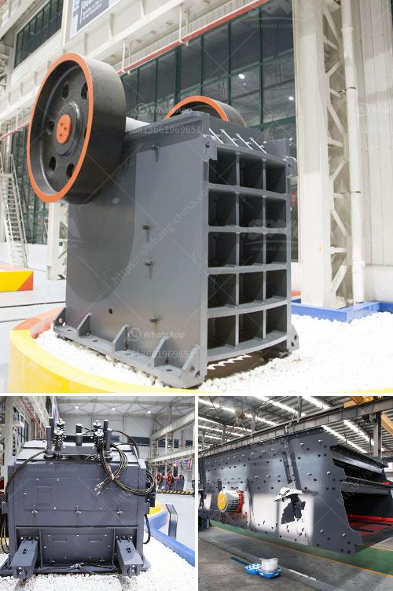

<h3>machinery required to extract the platinum</h3>
Platinum is a rare and highly valuable metal often associated with luxury and sophistication. With its remarkable resistance to corrosion, high melting point, and exceptional catalytic properties, it has become an essential component in various industries. However, the extraction process for platinum requires advanced machinery capable of handling the complexities involved. In this article, we will explore the machinery required to successfully extract platinum from its primary sources.

Platinum primarily occurs in nature as a byproduct of nickel and copper mining. Therefore, the machinery used for platinum extraction must be capable of processing vast quantities of minerals in search of this precious metal. In addition, depending on the platinum source, different techniques may be employed for optimal extraction.

To begin the extraction process, massive rocks and ore deposits are crushed into smaller particles using heavy-duty machinery such as crushers and mills. These machines must possess robust crushing capabilities to reduce the size of the raw material and ensure efficient extraction. Often, platinum ores are highly complex and require fine grinding to liberate the metallic particles for subsequent processing.

After crushing and grinding, the desired platinum particles can be separated from the bulk materials through flotation. This process exploits the difference in surface properties between platinum and other minerals. Machinery such as flotation cells is used to generate a frothy mixture, allowing the platinum particles to attach to air bubbles, while other non-valuable minerals sink.

Once the platinum particles are separated successfully, they undergo smelting, a crucial step in the extraction process. High-temperature furnaces are employed to heat the platinum concentrate, resulting in its transformation into metallic form. This molten platinum is then purified through a refining process that involves precise temperature control and chemical reactions to eliminate impurities.

In some cases, specific platinum-bearing ores may necessitate the application of hydrometallurgical techniques. These techniques typically involve the use of various chemicals and acids to selectively dissolve the platinum minerals. Machinery utilized in hydrometallurgy includes leaching reactors, agitators, ion exchange columns, and sophisticated filtration systems capable of handling corrosive substances.

Throughout the extraction process, advanced analytical instruments play a pivotal role in monitoring various parameters such as platinum concentration, chemical composition, and impurities. These instruments aid in process control, ensuring optimal conditions for maximum recovery. Examples of such technologies include atomic absorption spectrometers, X-ray fluorescence analyzers, and inductively coupled plasma-mass spectrometers.

As the mining industry has become increasingly conscious of environmental impact, machinery for platinum extraction has incorporated advanced technologies to mitigate ecological concerns. Innovative extraction machinery includes dust and gas control systems to minimize pollution, as well as water treatment facilities to ensure sustainable usage and prevent contamination.

The extraction of platinum requires a complex and technologically advanced process that relies heavily on sophisticated machinery. From crushing and grinding to flotation separation, smelting, and refining, each step demands specialized equipment to efficiently extract this highly valuable metal. Additionally, the utilization of advanced analytical instruments and environmental-friendly technologies further enhances the efficiency and sustainability of the platinum extraction process.

With continuous advancements in the field of extractive metallurgy, the machinery employed for platinum extraction continues to evolve. These innovative technologies not only maximize platinum recovery but also minimize environmental impact, ensuring a more sustainable and responsible approach to platinum mining.
<h3>Contact us</h3><ul><li><strong>Whatsapp:&nbsp;<a href="https://wa.me/8613661969651">+8613661969651</a></strong></li><li><a href="https://swt.shibang-china.com/?git&amp;zhl&amp;machinery required to extract the platinum"><strong>Online Service(chat now)</strong></a></li></ul><h3>Related</h3><ul><li><a href='how to use hammer mill.md'>how to use hammer mill</a></li><li><a href='coal crushing and washing plant for sale south africa.md'>coal crushing and washing plant for sale south africa</a></li><li><a href='jaw crusher design handbook.md'>jaw crusher design handbook</a></li><li><a href='small superfine grinder price malaysia.md'>small superfine grinder price malaysia</a></li><li><a href='quartz stone machine of india.md'>quartz stone machine of india</a></li></ul>