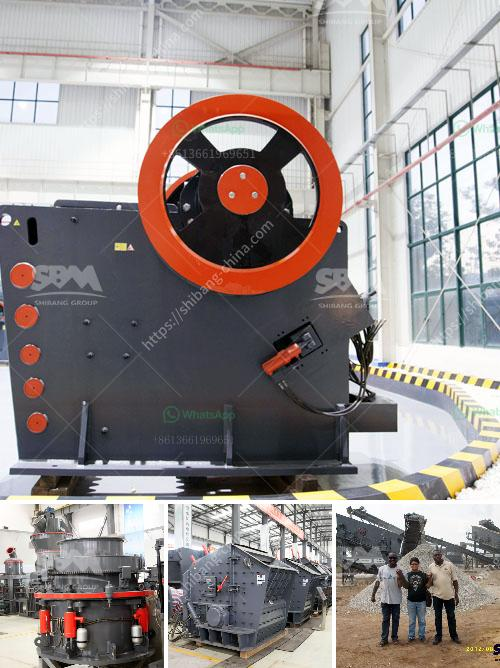

<h3>machines for stone crushing from poland</h3>
Poland has a rich history of producing top-quality machinery/equipment for various industries. One such industry that greatly benefits from their expertise is the stone crushing industry. Stone crushing machines have been manufactured in Poland for decades and are widely utilized in mining, construction, and infrastructure projects. These machines play a crucial role in efficiently breaking down large stones into smaller, more manageable sizes, which can be further used for building purposes or to create gravel and sand.

The stone crushing machines from Poland are designed with advanced technology and high efficiency in mind. They are equipped with robust jaw crushers, impact crushers, cone crushers, or vibrating screens, depending on the desired product size and specifications. These machines are built to withstand heavy-duty usage and offer optimal performance even in the harshest operating conditions.

What sets Polish stone crushing machines apart is their reliability and durability. Made from high-quality materials and manufactured to precise standards, these machines are built to last for years, significantly reducing maintenance and replacement costs. Additionally, the machines are easy to operate and maintain, requiring minimal downtime and ensuring maximum productivity.

Polish stone crushing machines also incorporate safety features to protect the operators and prevent accidents. For instance, they are equipped with various safety switches, emergency stop buttons, and protective guards to ensure safe operation. This emphasizes the commitment of Polish manufacturers to prioritize the well-being of the workers.

The machines for stone crushing from Poland are not only highly efficient and reliable but also eco-friendly. Many manufacturers adhere to strict environmental standards and incorporate sustainable practices into their production processes. These include the use of energy-efficient motors and adopting recycling techniques to reduce waste generation.

In conclusion, Poland has established a strong reputation for manufacturing top-quality stone crushing machines that are in high demand globally. These machines offer high productivity, durability, and reliability, making them a preferred choice for the stone crushing industry. With their advanced technology and commitment to safety and environmental sustainability, Polish manufacturers continue to innovate and provide efficient solutions for the ever-growing demand for stone crushing machines.
<h3>Contact us</h3><ul><li><strong>Whatsapp:&nbsp;<a href="https://wa.me/8613661969651">+8613661969651</a></strong></li><li><a href="https://swt.shibang-china.com/?git&amp;zhl&amp;machines for stone crushing from poland"><strong>Online Service(chat now)</strong></a></li></ul><h3>Related</h3><ul><li><a href='gypsum powder production plant ppt.md'>gypsum powder production plant ppt</a></li><li><a href='how to use hammer mill.md'>how to use hammer mill</a></li><li><a href='ball mill instrument equipment.md'>ball mill instrument equipment</a></li><li><a href='limestone crusher plant.md'>limestone crusher plant</a></li><li><a href='petroleum coke grinding.md'>petroleum coke grinding</a></li></ul>