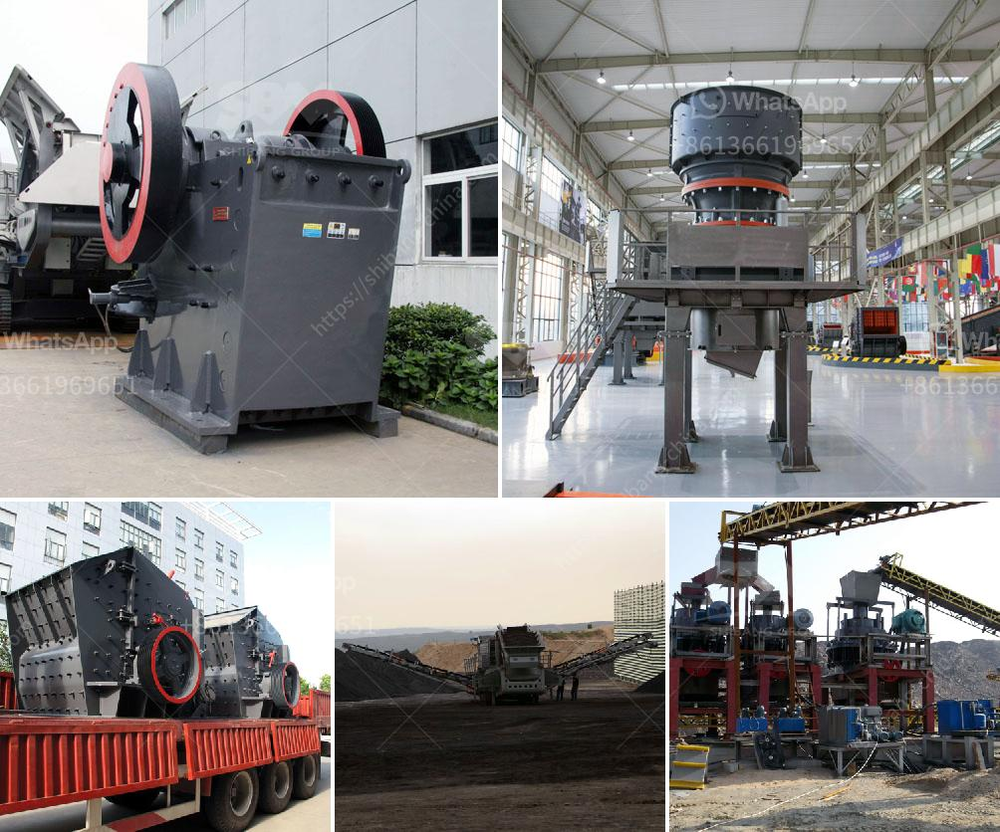

<h3>magnesium carbonate plant layout</h3>
Magnesium carbonate is a vital chemical compound used in various industries such as pharmaceuticals, cosmetics, food and beverage, and many others. To ensure efficient production and maximum output, a well-designed plant layout is crucial. A carefully planned magnesium carbonate plant layout plays a significant role in optimizing workflow, minimizing costs, and ensuring worker safety.

The first consideration in designing a plant layout for a magnesium carbonate plant is to determine the specific requirements of the production process. Understanding the equipment and machinery needed, as well as the overall workflow, is essential. This includes identifying areas for raw material storage, processing units, packaging units, and waste management.

Next, it is important to consider the flow of materials and workers within the plant. The layout should minimize unnecessary movement of materials and personnel, reducing the chances of accidents and optimizing efficiency. Proper allocation of space for each production unit should be planned according to their respective sizes and requirements.

Additionally, safety measures must be taken into account during the layout planning process. This entails ensuring proper ventilation, adequate lighting, and clear pathways to prevent accidents and provide a safe working environment for employees. Emergency exits and fire safety equipment should also be strategically placed throughout the plant layout.

Efficient storage of raw materials, intermediate products, and finished goods is another crucial aspect of the layout design. Appropriate space allocation should be planned to ensure easy access, prevent cross-contamination, and minimize the risk of spillage or damage to the products.

It is also necessary to consider future expansions or modifications in the plant layout design. Flexibility should be incorporated to accommodate potential changes in production volumes or the addition of new production lines.

In conclusion, a well-planned and organized layout is paramount for a magnesium carbonate plant to achieve maximum productivity, cost-effectiveness, and worker safety. By considering the specific requirements of the production process, flow of materials and workers, safety measures, and future expansions, a carefully designed plant layout will contribute significantly to the success of the plant.
<h3>Contact us</h3><ul><li><strong>Whatsapp:&nbsp;<a href="https://wa.me/8613661969651">+8613661969651</a></strong></li><li><a href="https://swt.shibang-china.com/?git&amp;zhl&amp;magnesium carbonate plant layout"><strong>Online Service(chat now)</strong></a></li></ul><h3>Related</h3><ul><li><a href='jaw crusher size.md'>jaw crusher size</a></li><li><a href='barytes pulverizer equipment.md'>barytes pulverizer equipment</a></li><li><a href='sandstone sand making machine manufacturer.md'>sandstone sand making machine manufacturer</a></li><li><a href='roller crusher on sale.md'>roller crusher on sale</a></li><li><a href='difference between jaw crusher and cone crusher.md'>difference between jaw crusher and cone crusher</a></li></ul>