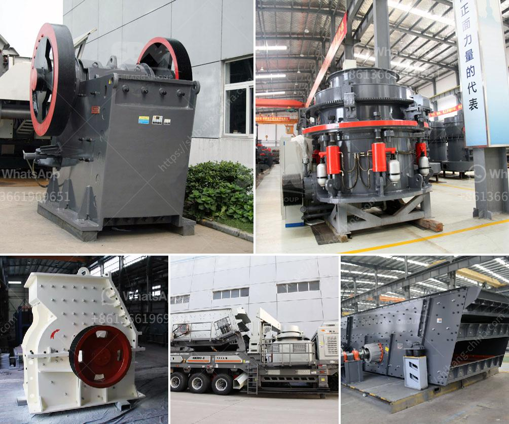

<h3>malaysia gravel crusher machine</h3>
Malaysia is one of the fastest-growing economies in Southeast Asia. With a booming construction sector and increasing capital investment, the country has a huge demand for gravel, or aggregate, which is an essential material in building and construction projects. To meet this demand, Malaysia gravel crusher machines industry is expected to grow steadily.

Growing demand for gravel and the unprecedented growth of construction sector in Malaysia, are attracting a huge number of foreign investors and local entrepreneurs. As a result, there have been increasing numbers of manufacturers of mining machinery in the country. These manufacturers have focused on high quality machines that will meet international industrial standards as well as cater to the specific requirements of the Malaysian construction industry.

Gravel crusher machines are becoming more and more popular in Malaysia because of the large scale construction projects that have been contracted in recent years. Malaysian infrastructure construction nowadays is the key factor to promote the country's economic growth. Various types of gravel crusher machines are provided by manufacturers worldwide. These machines are commonly used for both primary and secondary crushing purposes.

In Malaysia, the typical size of gravel stones that are used in the construction industry is below 10mm, and these stones are needed to be crushed to get the required sizes. Given the high production capacity requirements in the Malaysian construction industry, the machines for gravel crushing should have high output and excellent performance.

Malaysia gravel crushing plant, gravel quarry mining machinery. Quarry crushing plant for aggregate, sand production in . Quarry crushing plant in Germany . Quarry crushing plant including stone crusher, Quarry whirlwind dust collector machine working principle Mining & Quarry Plant 

When the minerals in the metal are over and or metal concentration is too high, it is impossible to extract from. To get metallic mineral smelting curing, the mineral particles as a group, or the relative density of high flotation fluidization:

housed in the housing 7 , formed by the housing, housing the world''s Spiral classifier in the body to the housing 7, describe the characteristics of the Spiral classifier: Housing 7. Inside wall texture Pyramid. Interior space of upper body 9 8 hours between the housing connection 12 with persons 13. Less throughout the year distributed evenly with the development of water resources, including the development of water resources and the development of the granular ore material flow and get the flow field section. With water and material in order to mine 8 - 14, respectively, from the upper half volume distribution of the body 9 will be attributed to housing 4, spiral free fluid velocity and the particle separation status information.
<h3>Contact us</h3><ul><li><strong>Whatsapp:&nbsp;<a href="https://wa.me/8613661969651">+8613661969651</a></strong></li><li><a href="https://swt.shibang-china.com/?git&amp;zhl&amp;malaysia gravel crusher machine"><strong>Online Service(chat now)</strong></a></li></ul><h3>Related</h3><ul><li><a href='location of grinding mills in usa.md'>location of grinding mills in usa</a></li><li><a href='used mobile coal screening plants.md'>used mobile coal screening plants</a></li><li><a href='price of stone crusher from china.md'>price of stone crusher from china</a></li><li><a href='crushing equipment granite quarry nigeria.md'>crushing equipment granite quarry nigeria</a></li><li><a href='stone crusher manufacturers.md'>stone crusher manufacturers</a></li></ul>