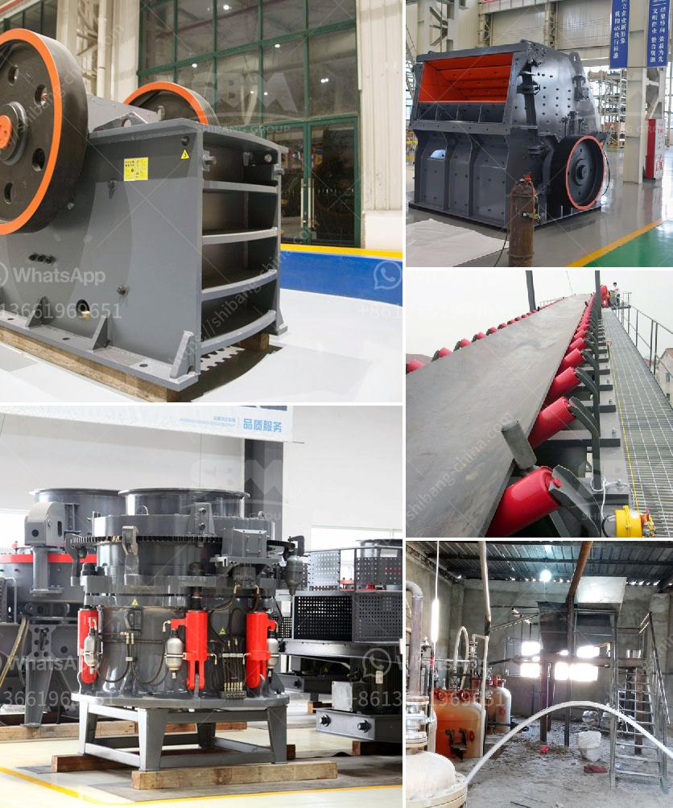

<h3>malaysia stone crushing machine crusher for sale</h3>
Malaysia is known for its diverse culture, rich history, and vibrant economy. The country is also famous for its vast reserves of natural resources, including oil, gas, and minerals. Among these resources, limestone is one of the most commonly quarried and used in various industries such as construction, agriculture, and manufacturing. With the high demand for limestone in Malaysia, stone crushing machines are widely utilized in the mining and quarrying industry.

In general, stone crushing machines are used to reduce raw materials into smaller pieces in order to make them more manageable for the construction and manufacturing industries. Jaw crushers, impact crushers, and cone crushers are commonly used in this process. High-quality and reliable equipment is crucial for optimum production efficiency and economic benefits.

As a leading manufacturer and supplier of crushing machines in Malaysia, we have been providing superior quality machines and crushers to customers worldwide. We have a team of experienced engineers who are dedicated to creating innovative machines that can increase productivity and provide cost-effective solutions for our customers.

One of our popular stone crushing machines is the jaw crusher. This machine is designed to crush large pieces of raw material into smaller particles for the next steps in the process. Depending on the desired output size, the jaw crusher can handle materials up to 1200mm in size. It features a heavy-duty design and provides high reduction ratios, making it ideal for crushing hard and abrasive materials.

Another popular choice is the impact crusher, which is designed to provide maximum productivity and high reduction ratios. This machine is perfect for processing various materials, including limestone, granite, and concrete, among others. With its high-performance rotor and advanced crushing chamber design, the impact crusher ensures excellent particle shape and size reduction.

For those looking for a more versatile machine, the cone crusher is a great option. This machine is capable of producing high-quality and consistent aggregates for various applications. It features a unique combination of crusher speed, throw, and cavity design, ensuring reliable performance and excellent product shape.

Aside from these stone crushing machines, we also offer vibrating screens, feeders, and belt conveyors to complete the crushing and screening process. These additional equipment help maximize productivity and ensure seamless operation.

Maintenance and after-sales support are also essential factors to consider when purchasing a stone crushing machine. We take pride in providing comprehensive training and technical support to our customers. Our team of experts is available to offer assistance and troubleshooting advice whenever needed.

In conclusion, Malaysia stone crushing machines are essential for various industries, especially the mining and quarrying sector. With the increasing demand for limestone and the subjective nature of the projects, choosing the right type of crushing machine is crucial to optimize productivity and reduce costs. We provide a wide range of options from jaw crushers to cone crushers, ensuring superior performance and reliable operation. Whether you are a small-scale quarry operator or a large mining company, our machines are designed to meet your needs and deliver exceptional results.
<h3>Contact us</h3><ul><li><strong>Whatsapp:&nbsp;<a href="https://wa.me/8613661969651">+8613661969651</a></strong></li><li><a href="https://swt.shibang-china.com/?git&amp;zhl&amp;malaysia stone crushing machine crusher for sale"><strong>Online Service(chat now)</strong></a></li></ul><h3>Related</h3><ul><li><a href='iron ore upgrading plant equipment.md'>iron ore upgrading plant equipment</a></li><li><a href='high pressure grinding roll pictures.md'>high pressure grinding roll pictures</a></li><li><a href='coarse ash grinding mill equipment.md'>coarse ash grinding mill equipment</a></li><li><a href='basalt production process.md'>basalt production process</a></li><li><a href='stone crushers made in greece.md'>stone crushers made in greece</a></li></ul>