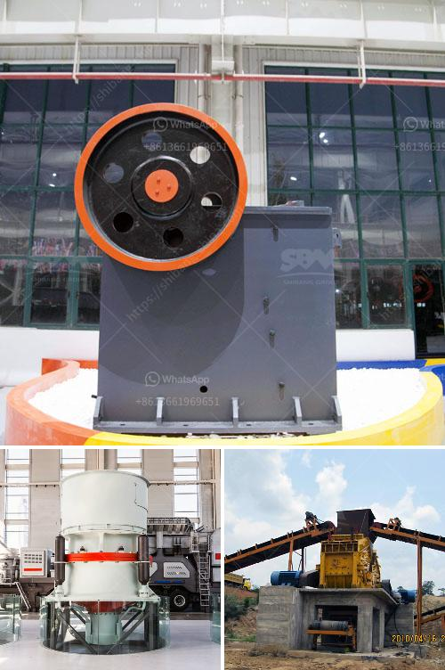

<h3>malaysia tin ore cursher supplier</h3>
Malaysia has been a prominent player in the global tin ore market for many years. With its rich deposits of tin, the country has attracted numerous international suppliers who rely on Malaysia as a major tin ore supplier.

One of the key players in the Malaysian tin ore market is the tin ore crusher supplier. Typically, the tin ore crusher machine consists of jaw crusher, cone crusher, impact crusher, ball mill, vertical roller mill, gravity separator, flotation machine, magnetic separator and classifier processing plants.

The tin ore crusher supplier in Malaysia plays an important role in the tin mining industry. As a major tin mining crushing equipment manufacturer in China, ZENITH can supply our clients with tin ore crushers and tin grinding mills for tin ore processing.

As a professional tin ore crusher supplier, we have exported thousands of mining equipment to more than 130 countries, including Malaysia, South Africa, Nigeria, Indonesia, Philippines and Zimbabwe. Customers looking for tin ore crusher supplier can contact us for their essential crushing equipment.

ZENITH has always been a reliable and professional tin ore crusher supplier. With years of experience in the mining industry, we have developed a range of advanced tin ore crushers and mills to meet the demands of our customers. Our tin ore crushers have a strong reliability and durability, ensuring long-term processing efficiency for various tin ore applications.

In addition to supplying high-quality tin ore crushers, we also offer various other mining equipment, such as tin ore magnetic separation equipment, tin ore separator, tin ore beneficiation equipment, etc. These devices can help our customers achieve higher productivity and efficiency in tin ore mining.

With our extensive experience and expertise, ZENITH has become a trusted supplier in the Malaysia tin ore market. We are committed to providing our customers with top-notch products, excellent customer service, and reliable technical support.

In conclusion, Malaysia is a leading supplier of tin ore in the global market, and the tin ore crusher supplier plays a crucial role in the tin mining industry. Tin ore crushers are widely used in tin mining crushing plant for tin ore beneficiation. ZENITH has been a reliable and professional tin ore crusher supplier in Malaysia. Our tin ore crushers are designed with high capacity and robust structure to meet the demands of various tin ore processing applications.
<h3>Contact us</h3><ul><li><strong>Whatsapp:&nbsp;<a href="https://wa.me/8613661969651">+8613661969651</a></strong></li><li><a href="https://swt.shibang-china.com/?git&amp;zhl&amp;malaysia tin ore cursher supplier"><strong>Online Service(chat now)</strong></a></li></ul><h3>Related</h3><ul><li><a href='how to use hammer mill.md'>how to use hammer mill</a></li><li><a href='crusher type 600 tph.md'>crusher type 600 tph</a></li><li><a href='write an article about cube crushing machine for concrete with 100300 words.md'>write an article about cube crushing machine for concrete with 100-300 words</a></li><li><a href='high pressure roller mill.md'>high pressure roller mill</a></li><li><a href='rental crusher rinda.md'>rental crusher rinda</a></li></ul>