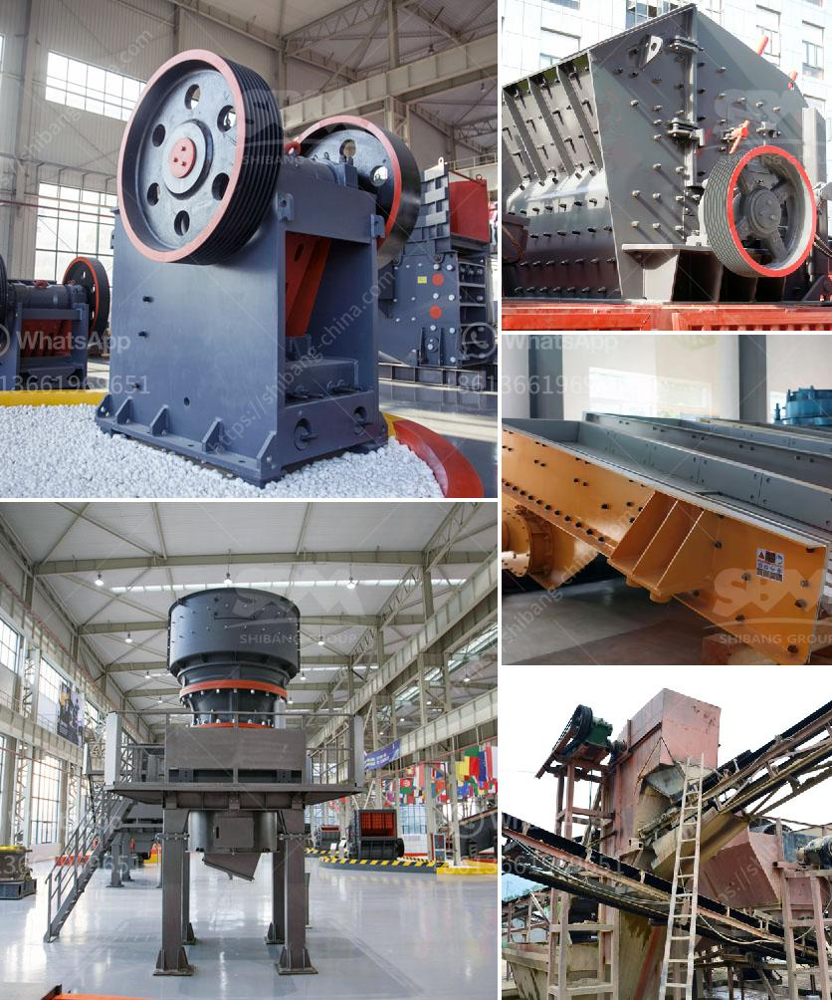

<h3>manganese crusher processing plant in india</h3>
Manganese is an essential mineral that is used in various industrial applications, including the production of steel, batteries, and fertilizers. India is one of the largest producers of manganese in the world. With its vast reserves and growing demand, the country has established several processing plants to extract and process this valuable mineral.

One of the prominent manganese processing plants in India is the manganese crusher processing plant. This plant is specifically designed for the efficient processing of manganese ore, which is a key component in the production of steel. The plant's primary purpose is to separate and refine manganese ore into various forms, such as manganese dioxide, manganese sulfate, and manganese nitrate, for different industrial applications.

The manganese crusher processing plant in India is equipped with advanced machinery, including crushers, conveyors, vibrating screens, and magnetic separators. This ensures smooth and efficient operation, as well as high-quality output. The plant processes manganese ore extracted from underground mines or open-pit mines, depending on the location of the deposit.

The processing starts with the crushing of the manganese ore into smaller pieces. The crushers break down the ore into manageable sizes, allowing for easier handling and transportation. Once the ore is crushed, it is then fed into vibrating screens, which separate the finer particles from the larger ones. The smaller particles are further processed through magnetic separators, which remove any impurities and improve the quality of the manganese concentrate.

The refined manganese concentrate is then processed into various forms, depending on the intended use. Manganese dioxide is commonly used in the production of dry cell batteries, while manganese sulfate is used in the production of fertilizers. Manganese nitrate, on the other hand, is used in the manufacturing of catalysts and explosives.

Apart from processing the manganese ore, the crusher processing plant also focuses on environmental sustainability. The plant employs various measures to minimize its impact on the environment, such as water recycling, dust suppression systems, and proper waste management practices. Furthermore, the plant adheres to strict safety protocols to ensure the well-being of its workers and prevent any accidents or mishaps.

Overall, the manganese crusher processing plant in India plays a vital role in the production of manganese-based products. Its efficient operation and adherence to environmental and safety standards make it a preferred choice for many manufacturers and industries. With the growing demand for manganese in India and worldwide, these processing plants are instrumental in meeting the needs of various sectors, including steel production, battery manufacturing, and agriculture.

In conclusion, the manganese crusher processing plant in India is a significant contributor to the country's manganese production. With its advanced machinery, efficient processes, and commitment to sustainability, it serves as a key player in the global manganese industry. With the continuous growth in demand for manganese, these processing plants are likely to expand their operations and contribute further to India's position as a leading producer of this valuable mineral.
<h3>Contact us</h3><ul><li><strong>Whatsapp:&nbsp;<a href="https://wa.me/8613661969651">+8613661969651</a></strong></li><li><a href="https://swt.shibang-china.com/?git&amp;zhl&amp;manganese crusher processing plant in india"><strong>Online Service(chat now)</strong></a></li></ul><h3>Related</h3><ul><li><a href='grinding mill in china.md'>grinding mill in china</a></li><li><a href='production of stone crusher.md'>production of stone crusher</a></li><li><a href='stone crusher 60 to 100 tonnes per hour.md'>stone crusher 60 to 100 tonnes per hour</a></li><li><a href='project cost of mini clinker grinding plant.md'>project cost of mini clinker grinding plant</a></li><li><a href='gypsum board manufacturing equipment.md'>gypsum board manufacturing equipment</a></li></ul>