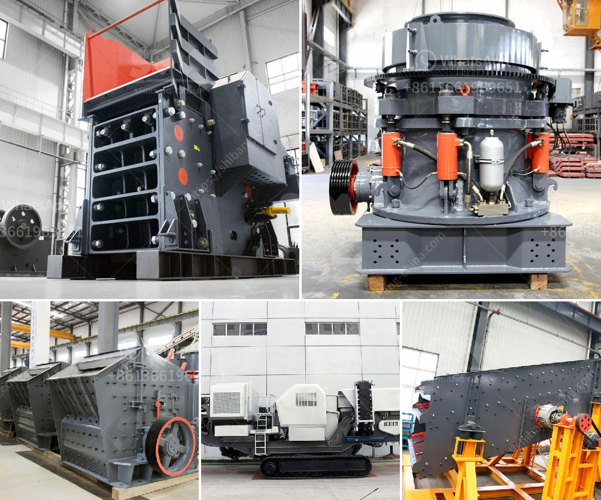

<h3>manganese crushing machine in china</h3>
Manganese is a metal element that is commonly found in combination with iron, and it is considered an essential mineral for maintaining good health. It plays a vital role in various physiological processes, such as bone development, metabolism, and antioxidant function. Due to its diverse applications in steel manufacturing, battery production, and chemical industries, the demand for manganese has been steadily rising globally.

China is one of the largest producers and exporters of manganese in the world, making it a key player in the manganese mining industry. The extraction of manganese ore generally involves crushing, screening, and beneficiation processes to remove impurities and increase the concentration of manganese content. This is where the manganese crushing machine comes into play.

A manganese crushing machine is essentially a specialized machine that automates the process of crushing manganese ore into smaller pieces. As the raw material enters the crushing chamber, it is subjected to mechanical forces from a high-speed rotating rotor, which is equipped with hardened steel hammers. The impact forces cause the material to break and transform into smaller-sized particles.

China has a diverse range of excellent manganese crushing machines. Jaw crushers, cone crushers, and impact crushers are among the most commonly used types of crushers in the manganese crushing process. With their excellent performance and high reliability, these machines have become indispensable equipment in the manganese mining industry.

One prominent example is the ZK6X series European type jaw crusher developed by Zhengzhou Dingsheng Engineering Technology Co., Ltd. This jaw crusher is designed with the latest technology and features a large crushing ratio, high output, and low energy consumption. Additionally, it is equipped with an adjustable discharge opening, making it adaptable to different manganese ore sizes.

In conclusion, manganese crushing machines in China play a crucial role in the efficient extraction of manganese ore from mines. With China's dominance in the global manganese mining industry, it is essential to have reliable and high-performing crushing machines to meet the increasing demand. The continuous advancements in technology will likely result in the development of more efficient and environmentally friendly machines in the future.
<h3>Contact us</h3><ul><li><strong>Whatsapp:&nbsp;<a href="https://wa.me/8613661969651">+8613661969651</a></strong></li><li><a href="https://swt.shibang-china.com/?git&amp;zhl&amp;manganese crushing machine in china"><strong>Online Service(chat now)</strong></a></li></ul><h3>Related</h3><ul><li><a href='how to make stone crusher plant.md'>how to make stone crusher plant</a></li><li><a href='barytes pulverizer equipment.md'>barytes pulverizer equipment</a></li><li><a href='stone crusher machine spintex accra.md'>stone crusher machine spintex accra</a></li><li><a href='used equipment cement for sale.md'>used equipment cement for sale</a></li><li><a href='chrome ore crushers and screeners for hire in south africa.md'>chrome ore crushers and screeners for hire in south africa</a></li></ul>