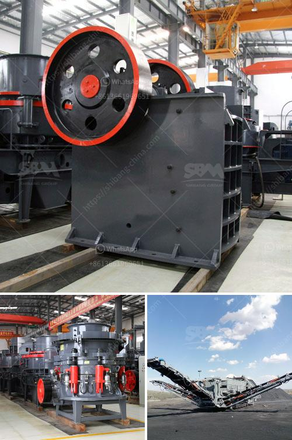

<h3>manganese ore mining processing process equipment</h3>
Manganese is a chemical element with symbol Mn and atomic number 25. It is not found as a free element in nature; it is often found in minerals in combination with iron. Manganese is a transition metal with important industrial alloy uses, particularly in stainless steels.

Manganese deposits are widely distributed in various countries, but mainly in the countries of South Africa, China, Ukraine, Australia, Brazil, India, etc. Manganese ore mining process involves crushing, screening, grinding, washing etc. In the manganese ore crushing plant, the main crushing equipment is jaw crusher, impact crusher, cone crusher, etc.

The manganese ore processing equipment includes feeding equipment, crushing equipment, screening equipment, washing equipment, and jigging equipment. The specific process steps are as follows:

1. Crushing and Screening: The mined manganese ore is transported to the crushing and screening site for processing. Large blocks of manganese ore are evenly sent to the jaw crusher or coarse crushing mobile station by the vibrating feeder for coarse crushing; the coarsely crushed manganese ore is screened by a vibrating screen and then sent to a single-cylinder hydraulic cone crusher for medium crushing; the crushed manganese ore material is sent to a multi-cylinder hydraulic cone crusher for fine crushing.

2. Grinding and Classification: After the manganese ore is crushed and screened, it is sent to the grinding mill for milling. The common grinding mill used in manganese ore processing plant includes ball mill, vertical roller mill, and Raymond mill, etc. The feeding equipment is responsible for uniform and continuous feeding of the ore mill. The grinding classification operation is guided by the principle of more crushing and less grinding.

3. Washing and Jigging: After grinding, the manganese ore pulp is sent to a series of washing units to remove impurities such as mud and clay. The fine-grained manganese ore pulp is sent to jigging separation equipment for gravity separation. The jigging separation equipment includes jigging machines and spiral classifiers. The jigging machine is used for rough separation, and the spiral classifier is used for fine separation and concentration.

4. Magnetic Separation: After gravity separation, the concentrated manganese ore can be further refined by magnetic separation equipment. Magnetic separation uses the magnetic properties of manganese minerals to separate them from the non-magnetic gangue minerals. The magnetic separation equipment includes magnetic separators and permanent magnet drum magnetic separators.

5. Drying and Packaging: The manganese concentrate obtained by various beneficiation methods needs to be dried before further use. After drying, it is packed and stored in a warehouse.

In summary, the manganese ore mining process involves crushing and screening, grinding and classification, washing and jigging, magnetic separation, and drying and packaging. Each step requires different equipment to complete. The specific equipment used will vary depending on the size and nature of the manganese ore and the beneficiation methods employed.
<h3>Contact us</h3><ul><li><strong>Whatsapp:&nbsp;<a href="https://wa.me/8613661969651">+8613661969651</a></strong></li><li><a href="https://swt.shibang-china.com/?git&amp;zhl&amp;manganese ore mining processing process equipment"><strong>Online Service(chat now)</strong></a></li></ul><h3>Related</h3><ul><li><a href='aggregate crusher plant.md'>aggregate crusher plant</a></li><li><a href='cheap mobile crusher.md'>cheap mobile crusher</a></li><li><a href='types of ball mill machine for gold.md'>types of ball mill machine for gold</a></li><li><a href='mobile crusher on rent for iron ore.md'>mobile crusher on rent for iron ore</a></li><li><a href='crusher plants for sale in south africa.md'>crusher plants for sale in south africa</a></li></ul>