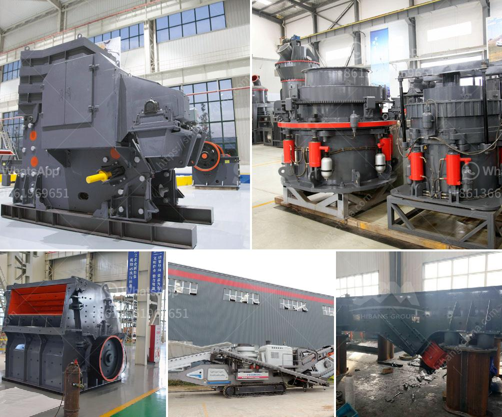

<h3>manganese ore sintering process</h3>
Manganese ore is a crucial resource that is used primarily in the production of steel and iron. Without manganese, the steel industry would not exist, and we would be without essential products such as cars, appliances, and buildings. Therefore, the process of sintering manganese ore is of great importance.

Sintering is a thermal agglomeration process that is applied to a mixture of iron ore fines, recycled ironmaking products, fluxes, slag-forming agents, and solid fuel (coke). The purpose of the sintering process is manufacturing a product with the suitable characteristics (thermal, mechanical, and metallurgical) to be fed to the blast furnace.

One of the main challenges in sintering manganese ore is achieving the desired chemical composition and formability characteristics, as manganese ore has a complex mineral composition. The sintering process allows for the heat treatment of manganese ore fines, which improves the ore’s physical and chemical properties and ensures a consistent quality product.

The manganese ore sintering process includes three main steps: the mixing of fine manganese ore, fuel, and fluxes; the igniting and heating of the mixture to initiate the sintering reactions; and the cooling of the final product before it is transported to a downstream facility for further processing.

The first step of the manganese ore sintering process is the mixing of the fine ore, fuel, and fluxes. The fine ore particles are carefully selected and mixed with a carbonaceous material, such as coke or charcoal, which serves as the fuel. Additionally, fluxes such as limestone or dolomite are added to aid in the formation of a slag during the sintering process. The combination of these ingredients is essential to achieve the desired chemical composition and formability characteristics.

Once the mixture is prepared, it is loaded onto a sintering machine, often referred to as a sintering bed. The sintering bed consists of a series of pallets or grids that carry the mixture. The bed is moved through a series of hot air chambers, where it is ignited and heated. The heat causes the mixture to agglomerate and form larger particles called sinter. This process is known as agglomeration.

The agglomerated sinter is then cooled using various cooling techniques, such as air or water cooling. The cooling process is crucial as it helps to stabilize the sinter and prevent it from breaking or crumbling. Once cooled, the sinter is ready for further processing and can be transported to a downstream facility for use in the production of steel and iron.

In conclusion, the manganese ore sintering process plays a vital role in the production of steel and iron. It allows for the agglomeration of fine manganese ore particles into larger, more manageable sinter, which can then be used as a feedstock in steelmaking. The sintering process ensures that the manganese ore exhibits the desired physical and chemical properties required for downstream processing. Without the sintering process, the manganese industry would struggle to meet the growing demand for steel and iron products.
<h3>Contact us</h3><ul><li><strong>Whatsapp:&nbsp;<a href="https://wa.me/8613661969651">+8613661969651</a></strong></li><li><a href="https://swt.shibang-china.com/?git&amp;zhl&amp;manganese ore sintering process"><strong>Online Service(chat now)</strong></a></li></ul><h3>Related</h3><ul><li><a href='buyers ball mill process.md'>buyers ball mill process</a></li><li><a href='iron ore crusher units in orissa.md'>iron ore crusher units in orissa</a></li><li><a href='nigeria hammer mill.md'>nigeria hammer mill</a></li><li><a href='mining process of mica crusher.md'>mining process of mica crusher</a></li><li><a href='clay ball mill machine.md'>clay ball mill machine</a></li></ul>