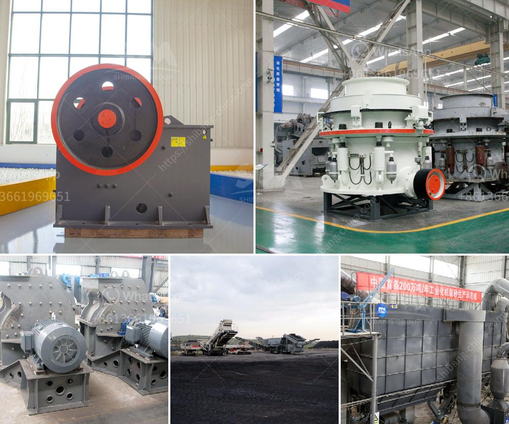

<h3>manufacturer of limestone process</h3>
Limestone is a sedimentary rock composed of calcium carbonate, commonly extracted from quarries and mines. Its versatile properties make it a popular choice in various industries, including construction, agriculture, and manufacturing. However, before limestone can be transformed into its useful forms, it undergoes an elaborate manufacturing process.

The first step in the limestone manufacturing process is quarrying. Here, large blocks of limestone are extracted from the earth's crust via blasting or drilling. Once extracted, the limestone is transported to a processing plant where it undergoes several crushing and screening stages to produce a range of sizes suitable for different applications.

After crushing, the limestone undergoes a pulverization process, where the limestone is ground into a fine powder. This powder is then mixed with water to form a slurry, which is pumped into a kiln. Inside the kiln, the limestone is heated to high temperatures, typically ranging from 900 to 1,500 degrees Celsius, to produce quicklime.

The quicklime is then cooled and stored before being transferred to another manufacturing facility. Here, the quicklime undergoes a process known as hydration. In this step, water is added to the quicklime to produce hydrated lime or slaked lime, commonly used in construction and industrial applications.

Throughout the entire limestone manufacturing process, quality control measures are implemented to ensure consistency and purity. Strict monitoring is conducted to maintain the optimum composition of the limestone products, as even slight variations can significantly affect their performance and suitability for various applications.

In conclusion, the manufacturing process of limestone involves quarrying, crushing, pulverization, calcination, hydration, and quality control measures. By carefully controlling each step of the process, limestone manufacturers are able to produce a range of high-quality limestone products that serve diverse purposes in various industries.
<h3>Contact us</h3><ul><li><strong>Whatsapp:&nbsp;<a href="https://wa.me/8613661969651">+8613661969651</a></strong></li><li><a href="https://swt.shibang-china.com/?git&amp;zhl&amp;manufacturer of limestone process"><strong>Online Service(chat now)</strong></a></li></ul><h3>Related</h3><ul><li><a href='crusher machine supplier malaysia.md'>crusher machine supplier malaysia</a></li><li><a href='calcium carbonate production plant.md'>calcium carbonate production plant</a></li><li><a href='small gold froth flotation unit.md'>small gold froth flotation unit</a></li><li><a href='mobile stone crusher 100 tph bangalore.md'>mobile stone crusher 100 tph bangalore</a></li><li><a href='fly ash grinding mill.md'>fly ash grinding mill</a></li></ul>