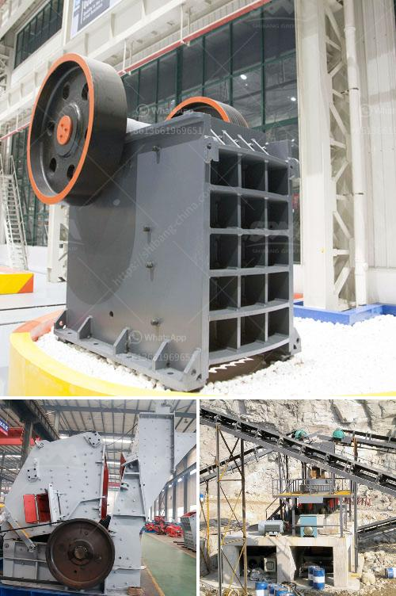

<h3>manufacturing company for ball mill</h3>
A ball mill is a type of grinder used to grind materials into extremely fine powder for use in mineral dressing processes, paints, pyrotechnics, ceramics and selective laser sintering. This new and innovative manufacturing company operates efficiently to provide high-quality ball mills with excellent functionality, reliability, and durability.

The ball mill manufactured by the manufacturing company is built with high-quality materials and is designed to meet all customer requirements. The design of the mill is in line with the latest industry standards, which ensures that the grinding process is highly efficient, reducing energy consumption and providing reliable performance.

One of the key features of the ball mill manufactured by this company is its adaptability to a wide range of materials. It can grind various ores and other materials either wet or dry. The company ensures that the mill is capable of grinding materials of different hardness and particle size, ensuring its versatility and applicability in various industries.

Furthermore, the manufacturing company is committed to providing excellent customer service. They have a team of skilled engineers who work closely with the clients to understand their specific needs and provide customized solutions. The company also offers after-sales services, ensuring that any technical issues or concerns are promptly addressed.

In addition to manufacturing high-quality ball mills, the company also focuses on environmental sustainability. They implement sustainable practices in their manufacturing processes, such as using energy-efficient machinery and recycling waste materials. By prioritizing environmental responsibility, the company ensures that their products not only benefit their customers but also contribute to a greener future.

In conclusion, the manufacturing company specializing in ball mills provides customers with a reliable and efficient solution for grinding various materials. With their high-quality products, excellent customer service, and commitment to environmental sustainability, this company is a trustworthy partner for any industry requiring a ball mill.
<h3>Contact us</h3><ul><li><strong>Whatsapp:&nbsp;<a href="https://wa.me/8613661969651">+8613661969651</a></strong></li><li><a href="https://swt.shibang-china.com/?git&amp;zhl&amp;manufacturing company for ball mill"><strong>Online Service(chat now)</strong></a></li></ul><h3>Related</h3><ul><li><a href='dubai stone crushing auction.md'>dubai stone crushing auction</a></li><li><a href='equipment for gold mine tailings in ghana.md'>equipment for gold mine tailings in ghana</a></li><li><a href='aggregate crushing cost analysis in india.md'>aggregate crushing cost analysis in india</a></li><li><a href='bauxite processing plant in taitata.md'>bauxite processing plant in taitata</a></li><li><a href='quartz grinding ball mill working.md'>quartz grinding ball mill working</a></li></ul>