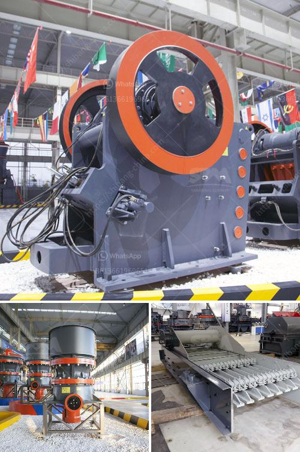

<h3>manufacturing of conveyor belts in the vaal region</h3>
The Vaal region, located in South Africa, is known for its thriving manufacturing industry. One of the key sectors in this region is the production of conveyor belts. Conveyor belts play a vital role in various industries, including mining, agriculture, and manufacturing, as they efficiently transport goods and materials from one point to another.

The manufacturing process of conveyor belts in the Vaal region involves several steps. Firstly, raw materials such as rubber, nylon, or steel are sourced from reliable suppliers. These materials are then processed and prepared for the production line. The rubber is mixed with additives to enhance durability and flexibility, while steel is shaped and tempered for strength. Nylon is also treated to enhance its tensile strength.

Next, the prepared materials are fed into the production line, where state-of-the-art machinery is used to create the individual components of the conveyor belt. The rubber or nylon is molded into the desired shape, while the steel components are welded or riveted together. These components are then assembled to form the final conveyor belt.

Quality control is a crucial aspect of conveyor belt manufacturing in the Vaal region. Each belt undergoes rigorous testing to ensure its strength, flexibility, and resistance to wear and tear. These tests include tension, elongation, and abrasion resistance tests. Only belts that meet the industry standards are released for sale.

Companies in the Vaal region take pride in their conveyor belt manufacturing capabilities. Their commitment to excellence is reflected in the final product. These high-quality conveyor belts are not only used locally but are also exported to other parts of the world.

In conclusion, the Vaal region is a flourishing hub for conveyor belt manufacturing. With its advanced technology, skilled workforce, and commitment to quality, this region continues to contribute significantly to the industry. The conveyor belts produced in the Vaal region play a crucial role in facilitating the smooth and efficient operation of various industries worldwide.
<h3>Contact us</h3><ul><li><strong>Whatsapp:&nbsp;<a href="https://wa.me/8613661969651">+8613661969651</a></strong></li><li><a href="https://swt.shibang-china.com/?git&amp;zhl&amp;manufacturing of conveyor belts in the vaal region"><strong>Online Service(chat now)</strong></a></li></ul><h3>Related</h3><ul><li><a href='vertical cement mill.md'>vertical cement mill</a></li><li><a href='aggregate washing machine.md'>aggregate washing machine</a></li><li><a href='jaw crusher typex.md'>jaw crusher typex</a></li><li><a href='gravel manufacturing company in thiruvallur district.md'>gravel manufacturing company in thiruvallur district</a></li><li><a href='quarry equipment in kenya.md'>quarry equipment in kenya</a></li></ul>