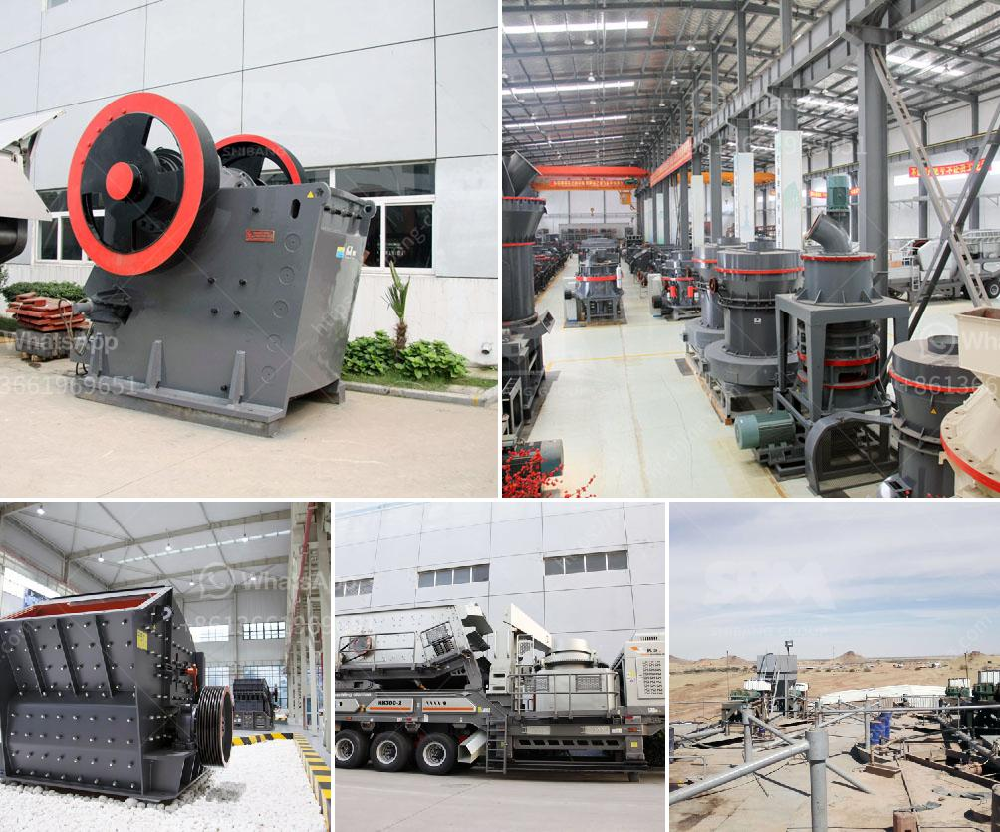

<h3>manufacturing process of kaolin crusher</h3>
Kaolin, also known as china clay, is a mineral that is found primarily in the inorganic clay mineral group. It is mainly composed of the mineral kaolinite and is valued for its fine particle size, high brightness, and whiteness. Kaolin is extensively used in various industries, including ceramics, paper, paint, rubber, plastics, and adhesives. To meet the growing demand for kaolin, manufacturers rely on the efficient manufacturing process of kaolin crushers.

The manufacturing process of a kaolin crusher involves multiple stages. First, the raw clay material is mined from the earth and transported to a processing plant, where it undergoes several processes such as crushing, drying, and milling.

The primary step in the manufacturing process is the crushing of kaolin clay rocks. This is achieved by using a variety of crushers, including jaw crushers, cone crushers, impact crushers, and hammer crushers. Each crusher type is specifically designed to handle different types of materials, ensuring efficient and precise reduction of the clay rocks to the desired size.

Once the raw clay material is crushed, it undergoes a drying process to remove any moisture content. The drying process is crucial as it ensures that the kaolin clay is free from moisture, which can adversely affect the quality of the final product. There are various drying methods used, such as rotary dryers, flash dryers, and spray dryers, depending on the specific requirements of the manufacturer.

After drying, the kaolin clay undergoes milling to further reduce its particle size and increase its surface area. Milling can be achieved through various techniques such as ball milling, attrition milling, or jet milling. The choice of milling method depends on factors such as desired particle size distribution and the specific properties required for the end application.

The finely milled kaolin clay is then sieved to remove any impurities or oversized particles. Sieving ensures that the final product meets the desired specifications and quality standards. Additionally, it helps in achieving a consistent particle size, which is crucial for the different applications of kaolin.

Finally, the processed kaolin clay is packaged and ready for distribution to various industries. The packaging process involves careful handling to ensure that the kaolin is protected from any contamination or damage during transportation. Manufacturers also provide detailed labeling and documentation to ensure traceability and compliance with industry regulations.

In conclusion, the manufacturing process of kaolin crushers plays a crucial role in providing high-quality kaolin products to various industries. Whether it is for ceramics, paper, paint, or rubber, the efficient extraction, crushing, drying, milling, and packaging of kaolin ensure that the final product meets the desired specifications and delivers optimal performance in its intended application. As demand for kaolin continues to grow, manufacturers must continually improve and optimize their manufacturing processes to meet the needs of their customers.
<h3>Contact us</h3><ul><li><strong>Whatsapp:&nbsp;<a href="https://wa.me/8613661969651">+8613661969651</a></strong></li><li><a href="https://swt.shibang-china.com/?git&amp;zhl&amp;manufacturing process of kaolin crusher"><strong>Online Service(chat now)</strong></a></li></ul><h3>Related</h3><ul><li><a href='price on a jaw crusher in south africa.md'>price on a jaw crusher in south africa</a></li><li><a href='jual jaw crusher 400 x.md'>jual jaw crusher 400 x</a></li><li><a href='mobile crushing machine sales in south africa.md'>mobile crushing machine sales in south africa</a></li><li><a href='feldspar stone crushing plant.md'>feldspar stone crushing plant</a></li><li><a href='mobile crusher machine.md'>mobile crusher machine</a></li></ul>