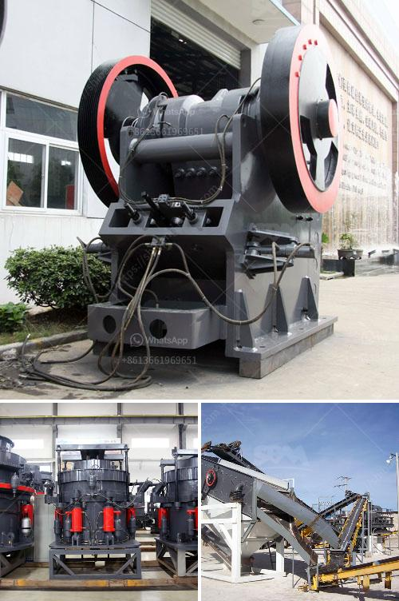

<h3>marbel grinding machine</h3>
Marble grinding machines are essential tools utilized for thorough polishing and refurbishment of marble floors. These machines are equipped with abrasive materials, diamond particles, and grinding discs to restore the original gleam and shine of marble surfaces. 

Marble floors are renowned for their elegance and grandeur. They have been used in various architectural designs and have become a staple in upscale establishments and luxury homes. However, over time, marble floors can succumb to wear and tear, losing their luster and leaving behind scratches and imperfections. To revive and maintain the opulence of these floors, marble grinding machines come to the rescue. 

One of the primary functions of marble grinding machines is to remove scratches and stains from marble floors. The machines' grinding discs delicately sand down the surface of the marble, smoothing out any uneven areas. This process is crucial for getting rid of scuffs, etching from acidic substances, and general wear and tear. By eliminating these blemishes, the machine ensures a smooth and flawless finish, restoring the marble to its former glory. 

Moreover, marble grinding machines also play a crucial role in restoring the shine of marble floors. Over time, marble can lose its shine due to a buildup of dirt, grime, and residue. The machine's abrasive materials and diamond particles efficiently clean the surface of the marble, removing any ingrained dirt and stubborn stains. This cleaning process enhances the marble's natural color and sheen, providing a breathtaking and bright appearance. 

In addition to floor restoration, marble grinding machines can also be used for marble resurfacing. This process involves removing the top layer of the marble to eliminate deep scratches, stubborn stains, or severe discoloration. Resurfacing restores the marble's uniformity, allowing homeowners and businesses to enjoy a fresh and flawless floor. It is particularly beneficial for older marble floors that have endured considerable damage over the years. 

Marble grinding machines are generally user-friendly and efficient to operate. They are equipped with adjustable settings, allowing users to set the desired speed, pressure, and angle for optimal grinding results. Furthermore, these machines often come with built-in water tanks and extraction systems, minimizing dust and debris during the grinding process. This not only promotes a safer working environment but also reduces the need for extensive cleanup afterward. 

In conclusion, marble grinding machines are indispensable tools for polishing, restoring, and maintaining marble floors. With their ability to remove scratches, stains, and imperfections, these machines play a vital role in preserving the elegance and beauty of marble surfaces. Whether for residential or commercial purposes, marble grinding machines provide a reliable and efficient solution for reviving worn-out marble floors. Investing in these machines ensures that marble floors continue to exude luxury and sophistication for years to come.
<h3>Contact us</h3><ul><li><strong>Whatsapp:&nbsp;<a href="https://wa.me/8613661969651">+8613661969651</a></strong></li><li><a href="https://swt.shibang-china.com/?git&amp;zhl&amp;marbel grinding machine"><strong>Online Service(chat now)</strong></a></li></ul><h3>Related</h3><ul><li><a href='china gold processing plant.md'>china gold processing plant</a></li><li><a href='ball mill mesh output.md'>ball mill mesh output</a></li><li><a href='kaolin clay mining process.md'>kaolin clay mining process</a></li><li><a href='ball crusher gold machine.md'>ball crusher gold machine</a></li><li><a href='grinding mills suppliers in china.md'>grinding mills suppliers in china</a></li></ul>