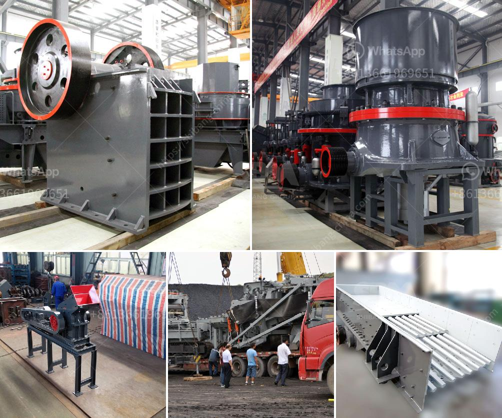

<h3>marble crusher price</h3>
Marble is an exquisite natural stone that has been widely used in construction and home decor for centuries. From statues and sculptures to kitchen countertops and flooring, marble adds elegance and sophistication to any space. However, the beauty of marble comes with a price tag, and one must consider various factors when it comes to purchasing a marble crusher.

The price of marble crushers can vary significantly depending on multiple aspects. Firstly, the quality and type of crusher play a crucial role. There are jaw crushers, impact crushers, cone crushers, and hammer crushers available in the market. Each type has its own advantages and disadvantages, and therefore the prices may vary accordingly.

Another key factor that influences the pricing of marble crushers is the size and capacity. The size of the crusher determines the amount of marble it can process at a given time. Crushers with higher capacities are usually more expensive due to their ability to handle larger quantities of marble.

In addition to these factors, the brand and reputation of the manufacturer also affect the price. Renowned manufacturers with a long-standing presence in the industry tend to charge higher prices for their crushers. However, it is important to keep in mind that established brands often provide better quality and after-sales service, which can be worth the additional cost.

When considering the price of a marble crusher, one must also factor in maintenance and operating costs. Regular maintenance is crucial to keep the crusher in optimal condition, and this may entail additional expenses. Furthermore, the electricity or fuel consumption should be taken into account to calculate the operating costs over the long term.

In conclusion, the price of a marble crusher can vary depending on the quality, type, size, capacity, and brand. It is essential to carefully evaluate these factors before making a purchase decision. Remember, investing in a reliable and high-quality crusher will ensure efficient and long-lasting marble processing, making it a worthwhile investment for any project.
<h3>Contact us</h3><ul><li><strong>Whatsapp:&nbsp;<a href="https://wa.me/8613661969651">+8613661969651</a></strong></li><li><a href="https://swt.shibang-china.com/?git&amp;zhl&amp;marble crusher price"><strong>Online Service(chat now)</strong></a></li></ul><h3>Related</h3><ul><li><a href='kobelco trituradora de cono.md'>kobelco trituradora de cono</a></li><li><a href='gypsum mill production.md'>gypsum mill production</a></li><li><a href='south africa mobile crusher.md'>south africa mobile crusher</a></li><li><a href='hammer mill ghana.md'>hammer mill ghana</a></li><li><a href='limestone vertical mill.md'>limestone vertical mill</a></li></ul>