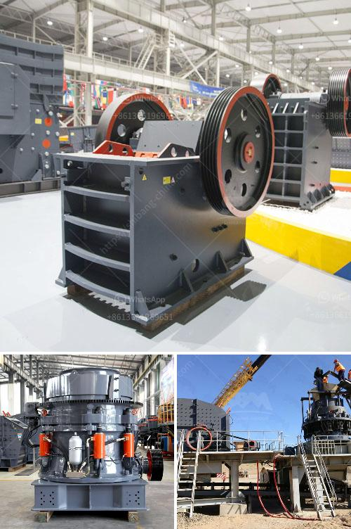

<h3>marble grinder mill machine price in pakistan</h3>
Marble is a luxurious building material that is used in both residential and commercial sectors. It is aesthetically pleasing and durable, making it a popular choice for flooring, countertops, and other decorative purposes. To achieve the desired finish and smoothness for marble surfaces, a marble grinder mill machine is essential.

In Pakistan, there is a wide range of marble grinding mills available in the market. These grinding mills vary in terms of design, size, and power. The selection of a particular machine for marble grinding should be based on the specific requirements of the application and the budget constraints.

The price of a marble grinder mill machine in Pakistan varies depending on factors such as the type of machine, brand, and specifications. The price range starts from a few thousand dollars and can go up to several thousand dollars. It is important to compare prices and features of different machines before making a decision.

In addition to the initial cost of purchasing a marble grinder mill machine, other factors such as maintenance and energy consumption should also be considered. Some machines may require regular maintenance and replacement of parts, which can add to the overall cost in the long run. Similarly, energy-efficient machines can help reduce electricity bills.

Investing in a high-quality marble grinder mill machine is a wise decision for businesses involved in the marble industry in Pakistan. A well-functioning machine not only enhances productivity but also ensures the production of high-quality marble products. It is recommended to consult with experts in the field and conduct thorough market research before making a purchase.

Overall, the price of a marble grinder mill machine in Pakistan may vary, but it is crucial to invest in a reliable and efficient machine that meets the specific needs of the business. With the right machine, businesses can produce excellent marble products, enhance their reputation, and capitalize on the growing demand for marble in Pakistan's construction and design industry.
<h3>Contact us</h3><ul><li><strong>Whatsapp:&nbsp;<a href="https://wa.me/8613661969651">+8613661969651</a></strong></li><li><a href="https://swt.shibang-china.com/?git&amp;zhl&amp;marble grinder mill machine price in pakistan"><strong>Online Service(chat now)</strong></a></li></ul><h3>Related</h3><ul><li><a href='cement production procedure in vertical mill.md'>cement production procedure in vertical mill</a></li><li><a href='sand core machine manufacturers.md'>sand core machine manufacturers</a></li><li><a href='dry grinding ball mill.md'>dry grinding ball mill</a></li><li><a href='used portable stone crusher machine for sale usa.md'>used portable stone crusher machine for sale usa</a></li><li><a href='machine for production of stone gravel crusher.md'>machine for production of stone gravel crusher</a></li></ul>