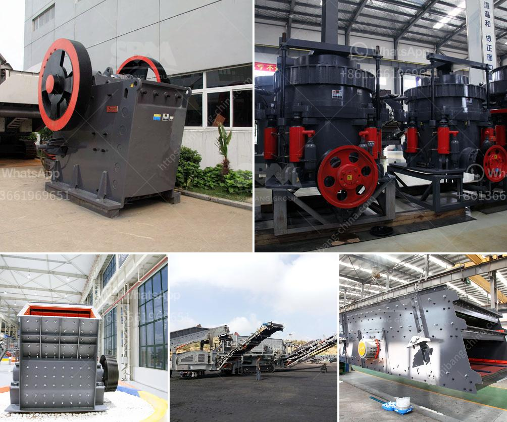

<h3>marble grinder mill machine</h3>
Marble is a kind of metamorphic rock that is formed from limestone or dolomite. The grains of marble are larger and usually have a distinct pattern, making it a favored material for construction and decorative purposes. To turn marble into a valuable resource, it requires several stages of grinding and processing. The marble grinder mill machine, with its proven technology and abundant advantages, has become an essential equipment in the marble processing industry.

One of the main features of the marble grinder mill machine is its adjustable fineness. This feature allows operators to control the grinding process and achieve different levels of fineness according to specific needs. For instance, when marble is used in decorative items like statues or sculptures, a finer grind is required to enhance its appearance. On the other hand, when marble is utilized as a construction material, a coarser grind is needed to provide better strength and durability.

Furthermore, the marble grinder mill machine is designed with a highly efficient dust collection system. This system effectively captures and filters out the majority of dust generated during the grinding process. The reduced dust pollution not only improves the working environment for operators, but also contributes to environmental protection by minimizing air pollution. This feature makes the marble grinder mill machine an ideal choice for companies seeking to meet strict environmental regulations.

In addition to its efficiency and environmental benefits, the marble grinder mill machine also boasts a long service life. The machine is built with high-quality materials and components that can withstand the harsh demands of continuous grinding operations. The robust design ensures minimal downtime and maintenance, leading to increased productivity and cost savings for businesses. Moreover, the machine is equipped with advanced safety features to ensure the well-being of operators and prevent accidents.

The marble grinder mill machine has a wide range of applications beyond the marble industry. It is widely used for grinding various materials, such as kaolin, limestone, basalt, calcite, marble, talcum, gypsum, dolomite, mica, and other more than 300 kinds of stone materials. These materials are the key to creating new markets and expanding the scope of application of marble grinder mill equipment.

In conclusion, the marble grinder mill machine has revolutionized the marble processing industry. Its adjustable fineness, efficient dust collection system, and long service life make it an indispensable tool for grinding and processing marble. The machine's versatility allows it to be employed in various industries beyond marble, further increasing its value and potential. With the continuous development of technology, the marble grinder mill machine continues to lead the way toward a prosperous future for the stone processing industry.
<h3>Contact us</h3><ul><li><strong>Whatsapp:&nbsp;<a href="https://wa.me/8613661969651">+8613661969651</a></strong></li><li><a href="https://swt.shibang-china.com/?git&amp;zhl&amp;marble grinder mill machine"><strong>Online Service(chat now)</strong></a></li></ul><h3>Related</h3><ul><li><a href='gypsum mill production.md'>gypsum mill production</a></li><li><a href='hammer mill 150 250.md'>hammer mill 150 250</a></li><li><a href='raymond mills for sale in pakistan.md'>raymond mills for sale in pakistan</a></li><li><a href='aggregate washing machine.md'>aggregate washing machine</a></li><li><a href='ball mill mesh output.md'>ball mill mesh output</a></li></ul>