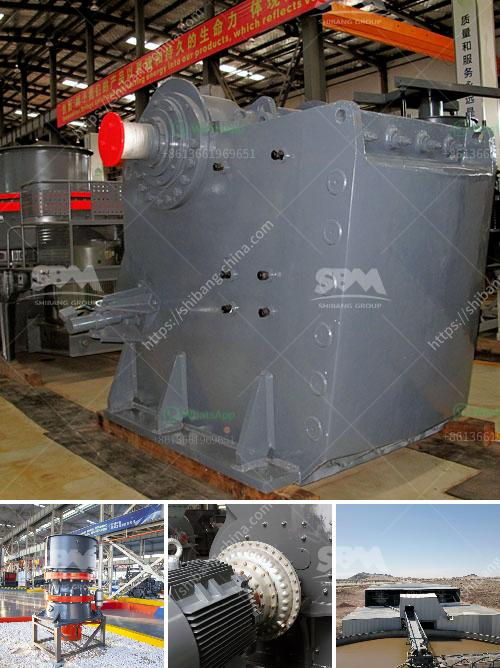

<h3>marble grinder price in india</h3>
Marble is a very popular stone that is used for flooring, countertops, and other decorative elements. It comes in various colors and patterns, making it a versatile choice for both traditional and modern designs. However, working with marble requires proper tools and equipment to ensure a quality finish.

One essential tool for marble fabrication is a marble grinder. A marble grinder is a handheld power tool that helps polish and shape marble surfaces. It uses different-sized diamond grits to grind and smooth the marble, resulting in a polished and refined finish. These grinders are commonly used by professionals in the marble industry, but they can also be used by DIY enthusiasts who want to work with marble.

The price of marble grinders in India depends on several factors, including the brand, quality, and power of the grinder. The price range for marble grinders starts from around Rs 5,000 ($70) and can go up to Rs 30,000 ($400) or more. The higher-priced grinders often have more power and additional features, making them more suitable for heavy-duty or professional use. However, there are also budget-friendly options available for those on a tighter budget.

When considering the price of a marble grinder, it's important to look beyond the initial cost. Consider the long-term value and durability of the grinder. Cheaper grinders may save you money upfront, but they may not last as long or provide the same level of performance as higher-end models. Investing in a quality, durable grinder can save you time, effort, and money in the long run.

Another factor to consider when purchasing a marble grinder is the availability and cost of replacement parts. Over time, the diamond grit pads used in the grinder will wear out and need replacement. It's essential to choose a grinder that has readily available and affordable replacement parts to ensure you can continue using the tool effectively without incurring high maintenance costs.

To find the best price on marble grinders in India, it's recommended to compare prices from different sellers and brands. Look for reputable suppliers who offer competitive prices and quality products. Online marketplaces and specialty stores that cater to the stone and marble industry are great places to start your search. You can also check for any ongoing promotions or discounts to get the best deal possible.

In conclusion, marble grinders are essential tools for working with marble surfaces. The price of marble grinders in India can vary depending on various factors, such as brand, quality, and power. It's important to consider the long-term value and durability of the grinder, as well as the availability and cost of replacement parts. By comparing prices from different sellers and brands, you can find the best price for a marble grinder that meets your needs and budget.
<h3>Contact us</h3><ul><li><strong>Whatsapp:&nbsp;<a href="https://wa.me/8613661969651">+8613661969651</a></strong></li><li><a href="https://swt.shibang-china.com/?git&amp;zhl&amp;marble grinder price in india"><strong>Online Service(chat now)</strong></a></li></ul><h3>Related</h3><ul><li><a href='portable machine stone crusher machine for sale.md'>portable machine stone crusher machine for sale</a></li><li><a href='used hammer mill for sale in south africa.md'>used hammer mill for sale in south africa</a></li><li><a href='fine grinding equipment.md'>fine grinding equipment</a></li><li><a href='old jaw crusher for sale in kenya.md'>old jaw crusher for sale in kenya</a></li><li><a href='calcium carbonate making machinery in germany.md'>calcium carbonate making machinery in germany</a></li></ul>