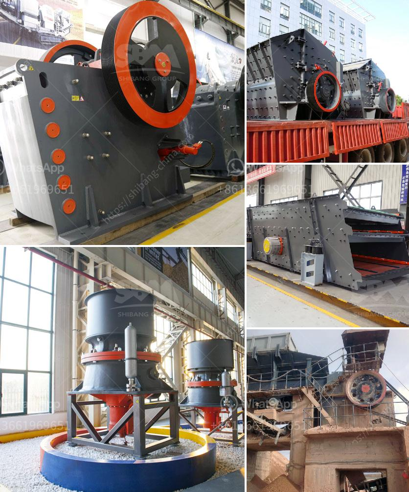

<h3>marble powder 100 mesh grinding machine</h3>
Marble powder 100 mesh grinding machine is designed by professional grinding engineers based on many years experience. According to users suggestions, the machine adopts advanced hydraulic technology to effectively improve the grinding efficiency, reduce dust pollution, and minimize occupational hazards. With the adoption of high-quality wear-resistant materials, the service life of the machine is greatly extended.

Marble powder, also known as marble flour, is formed from marble waste, which mainly consists of calcium carbonate. The marble powder can be used as a substitute for traditional construction materials such as cement, gypsum, and lime to enhance the strength and durability of concrete. It is also widely used in various industries including pharmaceuticals, cosmetics, paints, and plastics.

The marble powder 100 mesh grinding machine is an ideal grinding equipment for marble processing, which provides a reliable guarantee for the production of high-quality marble powder. Its high-speed revolving impeller can efficiently disperse, crush, and classify the materials. The final particle size can be adjusted by adjusting the frequency of the classifier wheel rotation, thereby meeting different production requirements.

Not only does the marble powder 100 mesh grinding machine have excellent performance, but it also has a user-friendly design. The machine is equipped with a touch screen control panel, which enables the machine to be easily operated and maintained. Moreover, it is equipped with a dust collector device to effectively collect and filter the dust generated during the grinding process, ensuring a clean working environment and reducing environmental pollution.

In conclusion, the marble powder 100 mesh grinding machine is a versatile and efficient grinding equipment. With its advanced technology and user-friendly design, it not only improves the grinding efficiency but also reduces dust pollution. It is definitely a great choice for marble processing industry.
<h3>Contact us</h3><ul><li><strong>Whatsapp:&nbsp;<a href="https://wa.me/8613661969651">+8613661969651</a></strong></li><li><a href="https://swt.shibang-china.com/?git&amp;zhl&amp;marble powder 100 mesh grinding machine"><strong>Online Service(chat now)</strong></a></li></ul><h3>Related</h3><ul><li><a href='grinding machine specification india price.md'>grinding machine specification india price</a></li><li><a href='use of the ball mill.md'>use of the ball mill</a></li><li><a href='belt jaw crusher nigeria.md'>belt jaw crusher nigeria</a></li><li><a href='price on a jaw crusher in south africa.md'>price on a jaw crusher in south africa</a></li><li><a href='nepal jaw crusher or sale.md'>nepal jaw crusher or sale</a></li></ul>