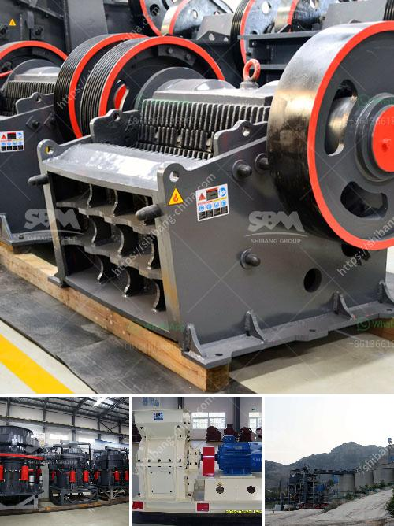

<h3>marble powder mill machinery</h3>
Marble has been a symbol of beauty and elegance for centuries. Its unique veining and luxurious appearance have made it a favored choice for the construction of various architectural wonders, sculptures, and even household items. But what happens to the leftover marble after these masterpieces are created? The answer lies in marble powder mill machinery.

Marble powder is a byproduct generated during the cutting and polishing process of marble stones. Traditionally, it has been discarded as waste, leading to environmental concerns and wastage of resources. However, with advancements in technology, the marble powder can now be repurposed to create new products and add value to the construction industry.

Marble powder mill machinery is designed to efficiently grind the marble stones into fine powder or micro powder to be used in various applications. The marble powder can be used as a filler in coatings, plastics, ceramics, and other industries, which enhances the performance and durability of these products. Additionally, it can be added to concrete mixes to improve strength and workability, making it a valuable ingredient in the construction industry.

The process of transforming marble stones into powder involves a series of steps. Firstly, the marble stones are crushed into smaller pieces using specialized machinery. Then, the pieces are further ground down to a fine powder using marble powder mill machinery. This machinery consists of a rotating drum with steel balls inside, which grind the marble stones into the desired powder consistency.

One of the significant advantages of using marble powder mill machinery is its eco-friendly nature. By utilizing the waste marble powder, we can minimize environmental pollution and contribute to sustainability. Moreover, the use of marble powder reduces the need for mining new materials, conserves energy, and reduces carbon emissions associated with the production of traditional construction materials.

In conclusion, marble powder mill machinery offers a sustainable solution for repurposing waste marble into valuable products. The versatility and eco-friendly nature of marble powder make it an attractive choice for various industries, including construction, coatings, and plastics. By adopting this technology, we can not only enhance the beauty of our homes but also contribute to a greener and more sustainable future.
<h3>Contact us</h3><ul><li><strong>Whatsapp:&nbsp;<a href="https://wa.me/8613661969651">+8613661969651</a></strong></li><li><a href="https://swt.shibang-china.com/?git&amp;zhl&amp;marble powder mill machinery"><strong>Online Service(chat now)</strong></a></li></ul><h3>Related</h3><ul><li><a href='crusher machine discount.md'>crusher machine discount</a></li><li><a href='caterpillar stone crusher.md'>caterpillar stone crusher</a></li><li><a href='business plan for stone quarry crusher pdf.md'>business plan for stone quarry crusher pdf</a></li><li><a href='impact crushers nigeria.md'>impact crushers nigeria</a></li><li><a href='impact crusher machine.md'>impact crusher machine</a></li></ul>